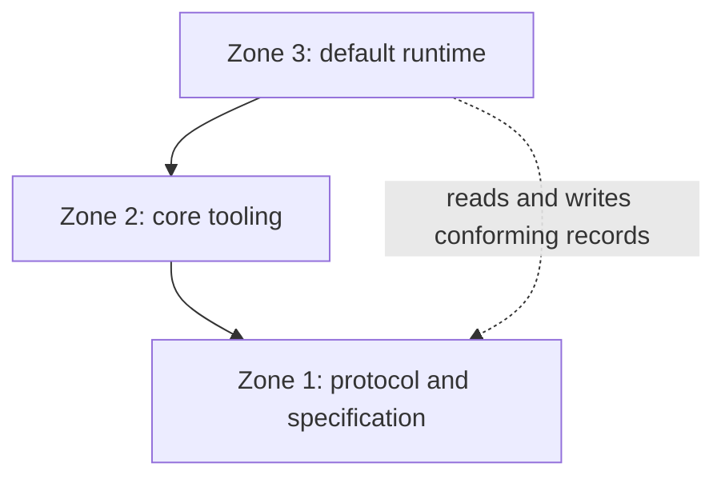
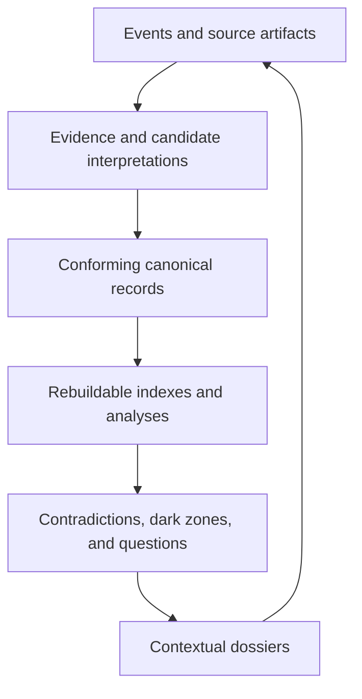

# GraphTruth Architecture

> Status: initial, non-normative architecture note. It establishes boundaries and
> invariants, not a frozen serialization format or implementation plan.

GraphTruth is a durable epistemic memory: it records what was observed, what was
claimed, which evidence supported or challenged it, which attributed assessments
were made, which explicit acceptance decisions applied, what remains unknown,
and how that record changed over time.

It is deliberately not a database that claims to contain "the truth." Truth is
rarely available as a context-free stored value. GraphTruth instead preserves the
material from which a person or system can construct an auditable view of the
best-supported knowledge for a particular purpose and point in time.

The architecture follows from one longevity requirement: the useful knowledge
must outlive any current database, index, model, service, or GraphTruth runtime.

## Architectural principles

1. **Protocol before product.** Stable semantics and portable records form the
   core. A particular application is only one implementation of them.
2. **Files carry the canonical record; services accelerate access.** Human- and
   machine-readable files preserve durable records. Databases, search engines,
   vector stores, and caches are rebuildable materializations.
3. **Claims, assessments, and acceptance decisions are distinct.** A claimant can
   revise or withdraw a claim; other actors can support or dispute it; a named
   policy can accept it for a purpose. None of those actions is a global truth
   status on the assertion.
4. **Provenance is preserved at evidence resolution.** A conclusion should be
   traceable to the exact source material and transformation that produced it.
5. **History is not silently overwritten.** Revisions, claimant withdrawals,
   assessments, acceptance decisions, merges, and changing interpretations are
   separately attributable records. Controlled redaction is explicit.
6. **Time has two axes.** GraphTruth distinguishes claimed applicability in the
   represented domain from visibility in the ledger.
7. **Uncertainty and ignorance are first-class.** Contradictions, unsupported
   assertions, unanswered questions, and coverage gaps are useful state rather
   than ingestion failures.
8. **Automation proposes; authority is explicit.** Probabilistic algorithms may
   extract, rank, link, and hypothesize. They do not silently issue acceptance
   decisions, perform irreversible entity merges, or establish causal conclusions.
9. **Extensions degrade safely.** A reader that does not understand an extension
   must preserve it and refuse unsupported semantic decisions, not guess.
10. **The monorepo is a deployment convenience, not an architectural coupling.**
    Logical boundaries are enforced from the start even while specification,
    tooling, and runtime evolve together in one repository.

The [invariant map](INVARIANTS.md) tracks which of these commitments currently
have executable evidence and which still need specification, conformance, or
runtime proof.

## Three architectural zones

GraphTruth is divided by semantic authority and replacement cost rather than by
process or deployment topology.

| Zone | Responsibility | Typical contents | Longevity expectation |
| --- | --- | --- | --- |
| **1. Protocol and specification** | Defines meaning, invariants, compatibility, conformance, and any deterministic behavior required for interoperability | Object semantics, lifecycle rules, time model, extension mechanism, normative algorithms, conformance requirements | Must survive implementations and vendors |
| **2. Core tooling** | Makes the protocol executable and testable without becoming the source of truth | Parsers, validators, canonicalizers, reducers, migrators, renderers, transformers, reference algorithms, test vectors | Replaceable, but intentionally conservative and portable |
| **3. Default runtime** | Provides a useful working product and operational scale | Ingestion connectors, queues, extractors, LLM integration, graph/full-text/vector indexes, APIs, UI, ranking and discovery policies | Freely replaceable and continuously evolvable |

The dependency direction is one-way:



Zone 1 must not depend on a particular programming language, database, embedding
model, LLM, operating service, or UI. Zone 2 may supply reference algorithms and
conformance fixtures for Zone 1, but cannot silently change its meaning. Zone 3
is the default product implementation and may choose aggressive heuristics and
storage technologies, provided its durable output remains valid under the
protocol.

Initially, all three zones live in this monorepo. They should be separate modules
with explicit dependency boundaries and independently testable contracts. A split
into multiple repositories is justified only when release cadence, ownership,
language/toolchain, distribution, or scaling constraints make the monorepo an
actual obstacle. Repository size alone is not a reason to split.

Protocol reference algorithms and conformance behavior belong to Zone 2 tooling
and tests. The end-to-end application is the Zone 3 default runtime; it remains a
replaceable implementation and gains no normative authority from living in the
same repository.

## Two independent classification axes

Two distinctions that sound similar are independent and must not be collapsed.

### Persistence: canonical record or disposable materialization

The canonical ledger is a set of portable files containing records intentionally
retained as durable GraphTruth history and references to source artifacts. The
exact file layout and encoding are intentionally not fixed by this document. A
future serialization must, however, support:

- stable identifiers and explicit protocol versions;
- human inspection and ordinary diff/review workflows;
- lossless round trips and preservation of unknown extensions;
- exact references from claims to versioned or integrity-addressed evidence;
- assertion revisions, assessments, acceptance decisions, claimant withdrawals,
  and non-destructive identity decisions;
- valid-time and recorded-time semantics;
- named policies, actors, tools, and transformation provenance;
- deterministic validation and portable migration;
- partitioning or external references for sensitive and large artifacts;
- explicit tombstones or redaction records where source material cannot remain.

Source artifacts need stable versions or integrity identities so an
`EvidenceSpan` never silently moves when a document changes. Privacy, law, or
secret rotation may require controlled redaction or removal. A retained record
then identifies what version was affected, why the evidence is unavailable where
that may be disclosed, and which verifications are no longer possible. An
integrity digest must not be used to retain forbidden sensitive content by
indirection.

File-first does not mean "Git is the database," "everything is one text file," or
"all data is public." Files may be managed by Git, object storage, encrypted
volumes, synchronization tools, or future systems. The protocol's responsibility
is portability and meaning, not a mandatory storage transport.

Specialized stores exist to answer questions quickly, not to decide what is true.
Disposable materializations may include relational or graph projections,
full-text and vector indexes, embedding caches, candidate tables, analysis caches,
and preassembled chunks or timelines. Deleting these stores and constructing new
access structures from canonical material is a core operability test. The new
structures need to preserve specified semantics; they need not be byte-identical
to historical indexes produced by different software or models.

If losing a disposable store would destroy a decision, assessment, evidence
reference, or other knowledge intended to survive, that durable record was placed
on the wrong side of the boundary.

### Epistemic origin: observed, source-derived, or inferred

Independently, a record may describe a direct observation, be derived from a
source, be computed by an algorithm, or be an attributed human assessment. None
of those origins determines persistence:

| Epistemic origin | May be canonical | May be disposable |
| --- | --- | --- |
| Direct observation | A retained event, measurement, or evidence artifact | A transient sensor buffer before durable capture |
| Source-derived interpretation | A retained assertion revision with exact evidence | A provisional extraction candidate or parse cache |
| Computed analysis | A retained analysis record needed for audit or future decisions | A ranking, embedding, conflict cache, or query result |
| Human assessment or decision | A retained assessment or `AcceptanceDecision` | A draft UI state not submitted to the ledger |

Thus *derived* does not mean *disposable*, and *canonical* does not mean *directly
observed* or *true*. When a derived result matters beyond the life of its current
runtime, it may become a canonical analysis record with its inputs, method/model
and version, assumptions, configuration, environment information where relevant,
and creation metadata. Reproducibility means preserving enough information to
interpret, audit, and, where dependencies remain available, rerun the analysis;
it does not promise byte-for-byte output from nondeterministic models or vanished
toolchains.

### Conditional archival and end-of-life completeness

GraphTruth can outlive its runtime only for a declared export scope and only when
the archive is complete enough for that scope. An end-of-life export should be
able to declare **archival completeness** and report exceptions. A complete
archive normally includes:

- canonical records, revision and decision history, and stable identifiers;
- required source-artifact versions, or explicit records of external,
  unavailable, licensed, or redacted evidence;
- the applicable protocol/schema versions and semantics of required extensions;
- named policy definitions needed to reconstruct fact views;
- media types, encodings, integrity metadata, and identifier-resolution data;
- validation results and an inventory of omitted or unverifiable dependencies;
- human-readable renderings for critical records where future tooling cannot be
  assumed.

No undisclosed essential state may live only in a disposable index. Conversely,
an archive cannot promise full evidence verification when referenced sources were
never captured or had to be removed, nor exact replay when a remote model,
external service, or nondeterministic environment is gone. Periodic offline
export validation and reconstruction of representative views should test the
claim before end of life rather than at it.

## Core object model

The objects below are semantic roles. They do not prescribe classes, tables,
files, or one-object-per-file serialization. The first group is the candidate
minimal base; the second group is intentionally deferred to future profiles so
that the initial protocol does not freeze an immature model of experience or
causality.

### Candidate minimal base roles

| Object | Purpose and essential boundary |
| --- | --- |
| **Event** | Records something received, observed, or performed, together with source, actor, and time. An event is an input to interpretation; it is not automatically a claim about the world. |
| **EvidenceSpan** | Selects an exact fragment of a particular version or integrity identity of a source artifact. A span establishes traceability, not credibility or truth; controlled redaction may later make it explicitly unverifiable. |
| **AssertionRevision** | Records an attributed version of a claim. Revision relations express authorial or claim-lifecycle changes such as correction, supersession, or claimant withdrawal; they do not encode other actors' disputes or policy acceptance. |
| **Assessment** | Records one actor's attributed evaluation of an assertion revision or its evidence, such as support, challenge, confidence, or a dispute. Assessments can coexist and do not mutate a global status on the assertion. |
| **AcceptanceDecision** | Records that a named actor or authorized policy execution accepted, rejected, or revoked acceptance of a specific assertion revision for a stated policy, purpose, and decision time. It is separate from both assertion revision and assessment. |
| **Entity** | Supplies stable identity for something referred to across records. Aliases, candidate matches, splits, and merges remain auditable; a heuristic match must not cause an irreversible merge. |
| **Question** | Represents a concrete unknown or decision-relevant uncertainty, why it matters, what evidence could answer it, and its lifecycle. Questions are durable knowledge, not failed assertions. |

A record's lifecycle state is role-specific. For example, an assertion revision
may be superseded or withdrawn by its claimant; a reviewer may separately dispute
it in an `Assessment`; a policy may separately revoke an `AcceptanceDecision`.
There is no single global `accepted` or `disputed` status on an assertion.

### Candidate future profile roles

| Candidate profile | Object | Purpose and essential boundary |
| --- | --- | --- |
| **Experience** | **ExperienceEpisode** | Preserves the path through a situation: goal, constraints, information visible at decision time, hypotheses and predictions, alternatives, decision, intended and actual intervention, observations, outcome, surprises, and later interpretations. |
| **Causality** | **CausalClaim** | States a proposed causal effect with an intervention and comparator, outcome, scope, horizon, assumptions, model, evidence basis, alternatives, and uncertainty. It is a claim node, never an unexplained `causes` edge. |
| **Mechanism** | **MechanismPattern** | Abstracts a reusable problem-and-mechanism structure from cases, including forces, intervention, expected transformation, applicability conditions, failure boundaries, examples, and counterexamples. |
| **Transfer** | **TransferAttempt** | Records an attempted application of a `MechanismPattern` from a source context to a target context: role mapping, material similarities and differences, adaptation, prior prediction, action, result, and learned limits. |

These roles require separate RFCs and conformance profiles before becoming
normative. An `ExperienceEpisode` does not manufacture causality: it records what
happened and what participants believed. A `CausalClaim` states a stronger
interpretation and its assumptions. A `TransferAttempt` provides evidence about
the practical portability of a `MechanismPattern`, not universal proof of it.

Relationships among records are assertions when contestable. Linking two names to
one entity, classifying an observation as an outcome of an intervention, or
claiming that an episode instantiates a `MechanismPattern` must therefore retain
provenance and support independent assessment and acceptance decisions.

## Bitemporality and revisions

GraphTruth answers two different historical questions:

- **Valid time:** for when does the assertion claim applicability in the
  represented world or domain?
- **Recorded time:** from when was the record visible in this ledger, according
  to the ledger's ordering and timestamp metadata?

An assertion recorded in July that claims a condition applied in March has March
valid time and July recorded time. This does not establish that the condition
truly held in March or that nobody knew it before July. Both axes may be intervals
and may carry uncertainty or granularity rather than false precision.

This supports an as-recorded retrospective view: a decision dossier can be
constructed from records visible as of the recorded decision time, while a
present-day dossier can include later revisions and outcomes. Calling that view
"without hindsight" is justified only to the extent that record ordering,
timestamps, late-entry markers, and append history are trustworthy. Backdating,
clock error, tampering, knowledge outside the ledger, and retrospectively entered
episodes remain possible. Timestamp integrity and optional trusted-time or signing
mechanisms require further protocol design.

### A fact is a view

`Fact` is not a privileged stored object. It is a derived view over assertion
revisions:

```text
Fact(policy, valid_at, recorded_as_of) =
    assertion revisions visible at recorded_as_of,
    applicable at valid_at,
    and covered by applicable AcceptanceDecisions
    visible at recorded_as_of under the named policy
```

The actual selection respects assertion-revision lifecycle, revocation and
decision time of `AcceptanceDecision` records, declared purpose, scope, context,
identity decisions, and extensions. The policy and its version are part of the
result's provenance. Different policies may legitimately produce different fact
views from the same ledger. Inclusion means usable for the purpose represented by
that policy; it does not mean timeless or globally true.

## Four relations that must not be conflated

| Relation | What it says | What it does **not** say |
| --- | --- | --- |
| **Provenance / derivation** | A record, source, actor, or activity contributed to producing another record | The source event caused the represented real-world event |
| **Temporal relation** | One event occurred before, after, or during another | The earlier event caused the later event |
| **Association** | Variables, events, or records co-occur or vary together under a stated analysis | Intervention on one would change the other |
| **Causation** | Under a stated model, scope, comparator, and assumptions, an intervention is claimed to change an outcome | Universal validity outside that scope or certainty beyond the evidence |

A rationale is different again: it explains why an actor chose an action, not
necessarily what caused the eventual outcome. A counterfactual is a model-derived
statement about an unobserved alternative, never an observation.

Causal discovery, root-cause analysis, and LLM-generated explanations therefore
produce candidate `CausalClaim` or analysis artifacts. They do not promote a
temporal or associative edge into an accepted-for-purpose causal assertion.

## End-to-end knowledge flow



1. **Capture.** Connectors receive events and source artifacts without treating
   their content as trusted instructions or policy-accepted knowledge.
2. **Anchor evidence.** Exact evidence spans are selected against a particular
   version or integrity identity of a source. Transformations such as
   transcription, OCR, or parsing retain their own provenance. Redaction never
   silently retargets a span to changed content.
3. **Propose interpretations.** Humans or algorithms propose entities, assertion
   revisions, questions, episode structure, causal hypotheses, or
   `MechanismPattern` records. Their inputs and tool identities are recorded.
4. **Validate and record.** Core tooling checks structural and semantic
   invariants. An authorized workflow may append a candidate, assertion revision,
   assessment, or acceptance decision as its own canonical record. Validation,
   canonical presence, assessment, and acceptance are separate outcomes.
5. **Project and enrich.** The runtime builds searchable graph, text, temporal,
   and vector projections. It may compute chunks and analysis candidates.
6. **Find conflicts.** Candidate contradictions are detected only after comparing
   entity identity, predicate meaning, scope, context, valid time, and modality.
   Disagreement is recorded through attributed assertions and assessments with
   evidence; neither side is erased or assigned a global disputed status.
7. **Find dark zones.** Coverage expectations, broken explanatory chains,
   unsupported high-impact assertions, missing outcomes, and competing hypotheses
   expose important unknowns. Mere absence from the ledger is not by itself proof
   that knowledge is missing from the world.
8. **Ask.** Questions are generated or promoted according to impact, uncertainty,
   answerability, risk, and expected information gain. Acquisition may request a
   source, observation, decision, experiment, or human judgment.
9. **Assemble a dossier.** Retrieval returns a query-specific context containing
   relevant assertions, exact evidence, provenance, counterclaims, temporal state,
   uncertainty, related questions, mechanisms, and applicability boundaries. It
   does not return an isolated embedding-neighbor fragment as if it were a complete
   answer.
10. **Learn from use.** New answers, outcomes, corrections, and, when the relevant
    profile is enabled, transfer attempts re-enter capture as events. The ledger
    grows; disposable stores are refreshed.

The runtime may expose a `KnowledgeChunk` for model or search consumption, but a
chunk is a derived projection. A `Dossier` is the richer, query-specific assembly
that restores relevant context around those chunks. Neither is a replacement for
canonical evidence and assertion history.

## Placement of algorithms

Algorithms are placed according to whether interoperability depends on their
exact semantics, not according to whether they are "important."

### Zone 1: normative behavior

The specification defines algorithms, or observable algorithmic requirements,
only where independently implemented readers must agree. Likely examples include:

- revision visibility at a recorded time;
- valid-time filtering and interval semantics;
- assertion lifecycle and supersession resolution without folding in assessments;
- applicability and revocation of `AcceptanceDecision` records;
- policy-identified fact-view construction;
- extension and version negotiation;
- deterministic identity and reference integrity rules where specified;
- canonicalization required for digests or signatures.

Whenever possible, Zone 1 specifies inputs, outputs, invariants, failure behavior,
and conformance vectors rather than a programming technique.

Canonicalization here means a specified deterministic representation used for
comparison, digests, or signatures. It does not rewrite meaning, discard unknown
extensions, resolve disagreement, or decide truth.

### Zone 2: protocol reference algorithms and mechanical tooling

Core tooling implements parsing, validation, canonicalization, migration,
timeline reconstruction, deterministic reduction, provenance closure, dossier
rendering, and conformance tests. These implementations are executable
explanations of the protocol, but another conforming implementation may replace
them. Their purpose is protocol agreement, not to make Zone 2 a default product.

### Zone 3: default implementation and heuristic algorithms

The runtime owns rapidly evolving choices such as event segmentation, extraction,
entity-match proposals, embeddings, semantic retrieval, conflict discovery,
question ranking, graph matching, causal discovery, active acquisition, and
mechanism-pattern and transfer recommendations.

Every non-deterministic or model-based result should be attributable to its input
snapshot, algorithm/model and version, parameters or policy, and creation time.
The result starts as a proposal. Confidence affects prioritization; it never grants
authority. Exact reruns may still differ; durable analysis records state the
reproducibility limits rather than claiming deterministic replay.

## Security and authority boundary

GraphTruth's most important security boundary is between **content that the
system has received or proposed** and **the capability to issue an
`AcceptanceDecision` or perform an action**.

- Source documents and event payloads are untrusted data. Embedded instructions
  cannot grant capabilities, change policy, or authorize external actions.
- Ingestion, proposal, assessment, acceptance decision, publication,
  administration, and external action are distinct capabilities. Deployments may
  combine roles for one person, but the protocol must preserve which role was
  exercised.
- Automated systems may create candidates and analyses. They may not silently
  issue `AcceptanceDecision` records, merge identities irreversibly, establish
  causation, suppress counterevidence, or execute real-world actions. An explicitly
  authorized policy executor may issue a decision, but the actor, policy, purpose,
  time, target revision, and result remain recorded.
- Each `AcceptanceDecision` is attributable to an actor or explicitly authorized
  policy execution and remains auditable independently of the assertion.
- Unsupported protocol versions or semantically required extensions fail safely.
  Readers preserve unknown material rather than reinterpret it.
- Indexes and model-facing projections follow least privilege and can omit
  sensitive fields. A vector store must not become an uncontrolled copy of the
  entire canonical corpus.
- Integrity checks can reveal source or record tampering, but a valid digest or
  signature proves identity/integrity, not correctness of the claim. Controlled
  redaction records when a prior evidence version can no longer be verified.
- Local trust and acceptance policy remains local. No GraphTruth service, model,
  vendor, or public registry acquires universal epistemic authority.

Subject to the archival-completeness conditions above, these boundaries let the
default runtime change quickly while the durable ledger remains inspectable and
portable after that runtime's end of life.
