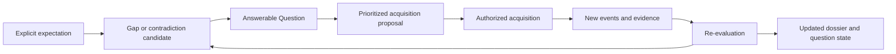

# Contradictions, Dark Zones, and Active Acquisition

> **Status:** Recovered design context — non-normative
>
> **Captured:** 2026-07-11
>
> **Authority / Promotion:** This draft records candidate taxonomies, analysis
> pipelines, and product policies. It defines neither a contradiction ontology
> nor an autonomous acquisition capability. Promote portable semantics through
> an RFC and the versioned specification; keep discovery, ranking, and action
> policy replaceable unless interoperability evidence requires otherwise.
>
> **Material provenance:** The end-to-end contradiction, dark-zone, question,
> and acquisition loop was recovered from the session. The detailed taxonomy,
> ranking candidates, safeguards, and evaluation plan were reconstructed and
> expanded during this archive pass; exact original wording is unavailable.

## Purpose and boundaries

GraphTruth should expose disagreement and ignorance instead of manufacturing a
clean graph. It should then turn important uncertainty into bounded acquisition
work: a question, a requested source, an observation, or a proposed safe
experiment.

The governing principles are documented in
[`PRINCIPLES.md`](../PRINCIPLES.md), especially the requirements that
contradictions and unknowns are first-class, context and time are part of
meaning, causation is not inferred from sequence, and active acquisition is
constrained by risk and privacy. Object and authority boundaries are documented
in [`ARCHITECTURE.md`](../ARCHITECTURE.md) and terms in
[`GLOSSARY.md`](../GLOSSARY.md).

This draft assumes:

- a contradiction is normally an attributable analysis candidate, not a status
  that mutates either assertion;
- a dark zone exists relative to an explicit expectation, goal, decision, or
  requested capability; absence from a corpus is not evidence of absence from
  the world;
- a `Question` is durable knowledge about an unknown, with answer criteria and
  lifecycle, not a failed assertion;
- a ranking policy does not acquire permission to contact a person, query a
  private service, spend money, disclose data, or execute an intervention;
- an answer may reduce, refine, or reopen uncertainty rather than close it.

## Shared analysis envelope

A candidate contradiction, dark zone, or generated question should be traceable
to:

- the canonical records and ledger horizon analyzed;
- the relevant valid-time window, context, scope, modality, and policy;
- the algorithm, model, ruleset, version, parameters, and producer;
- the expectation or constraint against which a gap or conflict was detected;
- the evidence supporting the candidate and evidence that weakens it;
- separate uncertainty dimensions and known unsupported semantics;
- an explanation suitable for review;
- creation time and later review, invalidation, supersession, or resolution.

These fields are a recovered design checklist, not a committed record shape.

## Contradiction discovery

### What must be aligned first

Two surface-different statements may agree, and two textually similar statements
may apply to different worlds. A contradiction candidate is meaningful only
after comparing at least:

- entity identity and identity uncertainty;
- predicate meaning and vocabulary mapping;
- normalized units, quantities, and value domains;
- scope, population, environment, and other applicability conditions;
- valid-time intervals and their uncertainty;
- modality, negation, quantification, and conditionality;
- claimant and whether one statement merely reports another;
- revision lifecycle and whether one claim explicitly corrects or narrows
  another;
- named policy and purpose where the compared result is policy-dependent.

An analysis must show which dimensions were considered and which remain
ambiguous. Missing alignment should lower confidence or stop classification; it
must not be filled with silent assumptions.

### Candidate contradiction taxonomy

The following classes are useful research and fixture categories. They are not a
normative closed vocabulary.

#### Explicit logical opposition

One assertion expresses a proposition and another expresses its negation under
shared interpretation and applicability. Lost negation and reported speech are
major false-positive sources.

#### Incompatible functional values

Two claims assign different values where a declared domain constraint allows at
most one value for the same subject, scope, and time. The functional constraint
must be explicit; many real-world predicates allow several values.

#### Disjoint numeric or interval constraints

Normalized ranges do not overlap, or a measured value violates an applicable
bound. Unit conversion, tolerance, measurement uncertainty, and temporal
granularity must be included before calling this a conflict.

#### Mutually exclusive classifications

Two types or states are incompatible under a declared profile. An open-world
ontology, changing state, or different classification schemes may make both
claims legitimate.

#### Temporal impossibility

The asserted ordering, duration, or overlap cannot hold under the known temporal
constraints. Clock uncertainty, late entry, timezone, and valid-time versus
recorded-time confusion must be ruled out.

#### Cardinality or relationship incompatibility

A set of relations violates an explicit uniqueness, cardinality, acyclicity, or
domain constraint. Such constraints are profile-specific rather than universal
facts about graph structure.

#### Competing causal or mechanistic claims

Claims identify incompatible effects, mechanisms, comparators, or explanations
under sufficiently shared conditions. Competing hypotheses may both remain
plausible; disagreement is not automatically formal contradiction.

#### Prediction-outcome conflict

An outcome falls outside a prospectively declared prediction or expected range.
This is evidence about the prediction, assumptions, or measurement; it is not by
itself proof of one particular alternative mechanism.

### States that must not be collapsed into contradiction

- a claimant revision correcting or narrowing an earlier revision;
- two assessments disagreeing about evidence quality;
- different actors applying different acceptance policies;
- claims for different populations, environments, time intervals, modalities,
  or purposes;
- an observation and a later interpretation of that observation;
- vocabulary differences that have not been mapped;
- absence of support for one claim;
- ordinary epistemic competition among incomplete hypotheses;
- an integrity or validation error in a record.

These states can still be important and discoverable, but they need their own
explanation and lifecycle.

### Candidate discovery pipeline

1. **Select a comparison horizon.** Identify recorded-time snapshot, valid-time
   query, policy, profiles, and access scope.
2. **Block candidate pairs.** Use shared entities, predicates, values, topics,
   constraints, or structural neighborhoods to avoid all-pairs comparison.
3. **Normalize cautiously.** Map units, time, aliases, and predicates while
   retaining the mapping provenance and ambiguity.
4. **Check applicability.** Compare scope, context, modality, quantifiers, and
   valid-time overlap before semantic opposition.
5. **Apply high-precision constraints.** Evaluate explicit profile rules,
   interval relations, exclusivity, and cardinality.
6. **Generate semantic candidates.** Rules, natural-language inference, language
   models, graph models, or hybrids may propose harder conflicts.
7. **Find conflict sets.** When useful, group mutually dependent candidates or
   find a small inconsistent subset rather than emitting every pair.
8. **Explain and score dimensions.** Report why simultaneous applicability seems
   impossible, along with identity, alignment, and classification uncertainty.
9. **Prioritize for review.** Consider decision impact, evidence quality,
   severity, novelty, and correction cost.
10. **Record an attributed result.** Preserve both sides and all counterevidence;
    do not choose a winner silently.
11. **Re-evaluate dependencies.** Revision, identity split, new context, or
    redaction may invalidate or refine the analysis.

Candidate technique spikes may compare rules, schema constraints, interval
algebra, description or constraint logic, SAT or SMT solving, NLI classifiers,
language models, and ensembles. A technique remains a Zone 3 choice unless a
specific deterministic constraint is promoted into a profile and conformance
fixtures.

### Contradiction failure modes

- false entity merge creates a large false conflict cluster;
- context, time, unit, modality, or quantifier is omitted;
- a quotation is attributed to the document author or ingesting system;
- a correction is interpreted as simultaneous competing belief;
- copied claims appear independent and inflate severity;
- model fluency hides that no exact evidence supports the classification;
- only the more recent or higher-scoring side is retained;
- a policy-dependent acceptance difference is described as world contradiction;
- a candidate is shown as formal inconsistency without the required ontology;
- redaction or unavailable evidence is treated as disproof.

### Contradiction evaluation

Measurements should be stratified by subtype and severity:

- candidate-pair recall before classification;
- precision and recall after full applicability alignment;
- false-positive rates caused by identity, scope, time, unit, and modality;
- calibration of each uncertainty dimension;
- reviewer agreement and correction effort;
- proportion of results with exact evidence and an intelligible explanation;
- time from a relevant canonical change to analysis invalidation;
- downstream decision impact of missed and false contradictions;
- preservation of both claims, their history, and counterevidence.

High precision may be more important than recall in the first personal version
if false alarms teach the owner to ignore the feature. The policy should remain
adjustable and measured in dogfood rather than frozen in the protocol.

## Dark-zone discovery

### A dark zone requires an expectation

GraphTruth cannot infer that the world lacks knowledge merely because a file is
absent. A reproducible dark-zone candidate should identify what made knowledge
expected. Candidate expectation sources include:

- required roles or fields in an enabled protocol or domain profile;
- a user goal, decision, plan, or declared risk model;
- a question's explicit answer criteria;
- a domain checklist or coverage template;
- an expected graph motif, workflow, explanatory chain, or causal chain;
- a requested dossier profile and its completeness requirements;
- a prediction whose outcome should later be observed;
- a decision dependency whose supporting evidence is missing;
- a retention, migration, or archival-completeness requirement.

The expectation itself needs identity, version, provenance, applicability, and
policy. Otherwise a gap cannot be reproduced after the detecting runtime is
replaced.

### Attributable expectation induction

An explicit expectation need not begin as a manually written rule. A runtime
may propose an `ExpectationCandidate` from repeated or neighboring structure,
but that proposal must become inspectable input to gap analysis rather than an
invisible assumption. Candidate sources include:

- roles that recur across comparable episodes, entities, workflows, or dossier
  requests;
- frequently observed graph motifs, dependency paths, state transitions, or
  outcome-capture obligations;
- competency questions, declared goals, decision models, and failure checklists;
- peer-group or historical coverage differences under a stated comparison
  cohort;
- counterexamples where an apparently optional element proved decision-critical;
- domain-profile, ontology-view, or mechanism candidates with their own
  provenance and uncertainty.

A candidate induction algorithm should state the population or denominator it
examined, the comparison cohort, minimum support, exceptions, access scope, and
the observations that would reject the expectation. It should test for capture,
selection, survivorship, and authorization bias: a pattern in visible records
may reflect what was easy to collect rather than what ought to exist.

Before an induced expectation drives a dark-zone alert or acquisition action,
it should be reviewed or enabled by a named local policy. Promotion does not
make it a universal ontology rule. Revision, split, retirement, and invalidation
of the expectation must re-evaluate dependent gap candidates without rewriting
their historical analysis horizon.

### Candidate dark-zone taxonomy

#### Missing required structure

A profile-required relation, episode role, evidence selector, outcome, or other
declared element is absent or unresolved.

#### Unsupported high-impact assertion

A decision-relevant claim has no cited evidence, only indirect evidence, or
evidence below a named policy's threshold.

#### Fragile or non-independent support

A claim appears well-supported but all support descends from one source,
transformation, or circular chain.

#### Broken explanatory or causal chain

A necessary intermediate state, mechanism, comparator, or observation is
unobserved. The break is a question, not permission to invent the missing edge.

#### Missing alternative or counterevidence

A decision or causal claim has no considered alternative, counterexample, or
discriminating observation despite an explicit expectation that it should.

#### Incomplete experience episode

An episode lacks the goal, constraints, alternatives, prospective prediction,
executed action, received intervention, observation, outcome, or separation of
later interpretation needed for its intended use.

#### Unresolved identity or semantic mapping

Knowledge may exist, but ambiguous identity, vocabulary, unit, or time prevents
safe connection and use.

#### Stale or expired knowledge

Evidence or an accepted-for-purpose view is older than a domain- or
decision-specific freshness expectation.

#### Competing hypotheses without discriminating evidence

Several explanations fit the current observations, and no retained evidence can
distinguish them.

#### Unavailable or unverifiable evidence

Evidence is external, licensed, redacted, deleted, corrupt, or inaccessible.
This differs from evidence never captured and from a claim with no evidence.

#### Coverage imbalance

An explicitly expected domain, population, period, source class, or failure class
is underrepresented. Corpus frequency alone must not manufacture an expectation.

### Distinguish forms of absence

A useful gap representation should not collapse:

- unknown in the represented domain;
- not captured by this ledger;
- not yet processed by a current projection;
- not applicable under the expectation;
- intentionally omitted by scope or retention policy;
- redacted or legally removed;
- externally referenced but unavailable;
- known only under an unsupported required extension;
- known but inaccessible to the current actor.

These distinctions affect both what may be asked and what may be disclosed.

### Candidate gap pipeline

1. Resolve the goal, decision, profile, query, or other expectation.
2. Select the authorized ledger horizon and relevant context.
3. Construct expected roles, dependencies, evidence qualities, or coverage.
4. Compare expectations with canonical records and declared projections.
5. Inspect provenance depth and independence, not only record count.
6. Detect broken paths, missing roles, stale dependencies, unresolved conflicts,
   and unverifiable evidence.
7. Propagate impact to the goals or decisions that depend on the missing item.
8. Classify the form of absence and preserve uncertainty about detection.
9. Cluster overlapping gaps and connect them to existing questions.
10. Produce a reviewable dark-zone candidate with an explanation and expectation
    identity.

Possible methods include deterministic completeness checks, graph reachability,
path and cut analysis, shape validation, dependency analysis, freshness rules,
coverage statistics, anomaly detection, and model-generated candidates. Graph
completion or link prediction may suggest what to investigate; it must not fill
the gap as if observed.

### Gap failure modes and metrics

Failure modes include an implicit universal ontology, mistaking inaccessible data
for absent knowledge, measuring document volume instead of decision coverage,
turning every empty field into noise, ignoring copied provenance, and generating
a gap whose acquisition would violate privacy or cost constraints.

Candidate measurements include:

- precision of actionable gaps under a named expectation;
- recall on synthetic missing-role and broken-chain fixtures;
- duplicate or overlapping gap rate;
- correct classification of unknown, unavailable, redacted, and not applicable;
- proportion linked to a concrete goal, decision, risk, or profile requirement;
- estimated versus realized downstream impact;
- user dismissal, refinement, and question-promotion rates;
- latency of refreshing a gap after new evidence arrives.

## From dark zones to questions

### Question construction

A question generator should seek the smallest useful answerable uncertainty, not
a grand prompt that invites unsupported synthesis. Candidate steps are:

1. Identify the decision, contradiction, hypothesis, or expected structure
   blocked by the unknown.
2. State the unknown without presupposing a preferred answer.
3. Separate factual, identity, temporal, evidential, causal, policy, and
   procedural subquestions.
4. Decompose a question until an acquisition route and answer criterion are
   plausible.
5. Link prerequisites, alternatives, and questions that can answer or subsume
   one another.
6. Deduplicate against open, answered, rejected, and reopened questions.
7. Record why the question matters and what would count as a sufficient,
   partial, conflicting, or negative answer.
8. Identify expiry, stopping, and reopening conditions.

Questions can also arise directly from a person, a failed transfer, a prediction
miss, a contradiction, or an unavailable source. Origin remains part of their
provenance.

### Question lifecycle hypothesis

Possible lifecycle concepts include candidate, open, planned, in acquisition,
partially answered, answered for purpose, blocked, declined, expired, and
reopened. These names are not a protocol proposal. Important distinctions are:

- an answer is itself an attributed assertion or evidence-bearing record;
- a question can have several competing answers;
- “answered for purpose” depends on explicit answer criteria and policy;
- new evidence, changed context, expiry, or contradiction can reopen it;
- a failed or refused acquisition remains useful history.

## Question prioritization

A replaceable policy may use several dimensions rather than one opaque priority
score:

- downstream decision impact and sensitivity;
- current uncertainty and disagreement;
- expected information gain or reduction in plausible alternatives;
- answerability with available methods;
- evidence quality likely to be obtained;
- monetary, computational, attention, and opportunity cost;
- latency and freshness deadline;
- safety, privacy, disclosure, legal, and ethical risk;
- reversibility of the proposed acquisition or intervention;
- dependencies unlocked for other questions;
- novelty versus duplication;
- value of a negative or inconclusive result.

Possible ranking methods include explicit weighted policies, Pareto frontiers,
expected value of information, Bayesian experimental design, adaptive
acquisition,
submodular selection, or constrained optimization. Every method embeds
assumptions. The displayed result should expose decisive dimensions and permit a
human to override it.

Priority never grants authority to perform the acquisition.

## Decision dependency and sensitivity

Several priority dimensions, especially decision impact and expected value of
information, require more than a graph-centrality score. A replaceable runtime
may construct a decision-analysis candidate containing:

- the goal, decision horizon, owner, stakes, and success or failure criteria;
- alternatives currently considered, including defer or preserve uncertainty;
- hard constraints, preferences, resources, deadlines, and reversibility;
- assertions, assumptions, predictions, and unknowns on which each alternative
  depends;
- outcomes or thresholds at which the preferred alternative would change;
- uncertainty about the decision model itself and material omitted factors.

Candidate algorithms may trace question-to-claim-to-decision dependencies,
perform local sensitivity or robustness analysis, identify decision boundaries,
compare regret under plausible states, and estimate value of information under
a named model. They should also preserve user-assigned impact separately from
inferred downstream impact.

A decision model is an analysis aid, not authority to choose or execute an
alternative. If utilities, probabilities, alternatives, or dependencies are
missing, the runtime should expose that limitation or generate a question
instead of producing a precise but unsupported impact or information-gain
score.

## Acquisition route selection

Candidate routes include:

- search or retrieve material already in the authorized corpus;
- request or import a known missing source;
- query an allowed external source under a declared disclosure policy;
- ask a named person for evidence or judgment;
- make a passive observation or measurement;
- instrument a future event or outcome;
- request review of an extraction, identity match, or conflict;
- propose a reversible simulation or safe experiment;
- defer, decline, or accept the uncertainty.

Route selection should consider expected evidential value, provenance quality,
cost, latency, privacy, safety, authorization, and reversibility. The system may
draft or propose an action; actual messaging, purchase, disclosure, measurement,
or intervention requires a separately authorized capability.

### Acquisition plans, portfolios, and replanning

Important unknowns may require several dependent acquisitions rather than one
ranked question. A candidate planner may:

1. construct a dependency graph of questions, answer criteria, routes, and
   decisions that could be unlocked;
2. identify one source, review, observation, or measurement that could address
   several questions without double-counting its evidence;
3. select a portfolio under monetary, compute, latency, attention, privacy, and
   risk budgets;
4. schedule prerequisites, mutually exclusive routes, freshness windows, and
   delayed outcome capture;
5. reserve budget for replication, counterevidence, or an alternative
   explanation instead of spending everything on a favored hypothesis;
6. replan after a partial answer, refusal, source failure, unexpected outcome,
   or changed decision deadline;
7. apply cooldown, batching, and burden limits when people would be interrupted;
8. stop, defer, or abandon a plan when marginal value falls below declared cost
   or risk limits.

The plan, budget assumptions, and decisive dependencies should remain
inspectable. Expected information gain is a model-dependent forecast, not a
promise that the acquisition will resolve uncertainty. Planning never grants
the capabilities needed to execute any route.

### Safe experiment proposal

Where experimentation is appropriate, a proposal may include:

- question and hypothesis;
- intervention and actual-exposure measurement;
- comparator or baseline;
- outcome, measurement method, and horizon;
- prospective prediction and uncertainty;
- confounders, assumptions, alternatives, and failure signals;
- safety, privacy, stopping, rollback, and escalation conditions;
- cost and resource limits;
- authorization required before execution;
- plan for retaining observations, deviations, and inconclusive results.

GraphTruth should not autonomously recommend or execute unsafe medical, legal,
financial, physical, or consequential experiments. Domain-specific safeguards
and human authorization are product and governance requirements beyond a generic
question score.

## Closed learning loop

The acquisition process itself produces knowledge: what was tried, which source
was unavailable, who declined, what it cost, whether a measurement failed, and
why an inconclusive result remained inconclusive. Keeping only the final answer
would recreate the loss of context GraphTruth is intended to prevent.

## Assimilating acquisition results

Re-ingesting an acquisition result does not by itself answer a question. A
candidate answer-assimilation and question-reduction pipeline should:

1. anchor the returned source, response, observation, or measurement to exact
   evidence and the acquisition attempt that produced it;
2. retrieve open and historical questions it may address without assuming that
   the route's target question is the only affected one;
3. align identity, scope, context, valid time, modality, units, and answer
   criteria before judging relevance or sufficiency;
4. classify the result as sufficient for purpose, partial, conflicting,
   negative within a stated search or measurement boundary, inconclusive,
   unavailable, refused, or unrelated;
5. preserve competing candidate answers and their provenance independence;
6. evaluate named answer and stopping criteria without treating one matching
   assertion, a fluent summary, or silence as resolution;
7. propose attributable lifecycle changes such as partially answered, answered
   for purpose, blocked, expired, or reopened;
8. update dependent questions, contradiction candidates, dark zones, decision
   sensitivities, and acquisition plans;
9. retain attempt cost, latency, disclosure, deviations, measurement quality,
   and reasons for non-resolution;
10. re-evaluate the same result when identity, evidence, expectation, policy, or
    answer criteria later change.

Where a portable Question profile eventually specifies deterministic lifecycle
semantics, a Zone 2 reducer may apply an explicit authorized decision. Semantic
answer matching, sufficiency judgment, and policy selection remain attributable
proposals unless an RFC establishes narrower interoperable behavior.

## Acquisition failure modes

- leading questions encode a desired answer;
- a large vague question produces a plausible summary instead of evidence;
- high expected information gain ignores risk or privacy;
- repeated questions burden a person because deduplication missed earlier
  attempts;
- the acquisition leaks private corpus material in a query or model prompt;
- an observation is treated as an intervention or an action as actual exposure;
- an experiment records only the successful outcome;
- a partial answer silently closes the broader question;
- a response is linked only to the question that caused the acquisition even
  though it resolves or contradicts other questions;
- silence, search failure, or inaccessible evidence is presented as a negative
  answer about the world;
- a multi-step plan spends its budget before a discriminating or replication
  step;
- model-generated text is mistaken for newly acquired external evidence;
- question priority is interpreted as permission to act.

## Feedback semantics

Behavioral feedback is evidence about the product interaction, not a truth
label. The runtime should distinguish at least display, opening, evidence
inspection, citation, dismissal, correction, explicit assessment, acceptance
for a purpose, action taken, later outcome, and question reopening. A click may
mean curiosity; no click may mean poor ranking, lack of time, or lack of access.

Any feedback-driven ranking or learning algorithm should retain the query and
exposure context, account for position, selection, survivorship, and repeated-
user bias, and avoid training directly on policy-generated outputs as if they
were independent judgments. Private feedback needs the same retention,
redaction, and disclosure controls as the underlying knowledge. Reviewed labels
and downstream outcomes should remain distinguishable from implicit behavior
and from `AcceptanceDecision` records.

## Active-acquisition evaluation

Candidate measures include:

- generated-question validity, atomicity, non-leading phrasing, and
  deduplication;
- proportion with explicit answer and stopping criteria;
- ranking agreement with declared decision priorities;
- estimated versus realized information gain;
- resolution, partial-answer, refusal, and reopen rates;
- cost, latency, human attention, and privacy exposure per useful answer;
- percentage of suggestions requiring but lacking authorization;
- safety violations or near misses, with a zero-tolerance class where relevant;
- downstream correction, decision improvement, or avoided uncertainty;
- retention of negative and inconclusive acquisition outcomes.
- accuracy and calibration of answer-state proposals, including reopen events;
- portfolio value and duplicated acquisition cost versus one-question ranking;
- decision-boundary changes and realized value compared with predicted impact;
- feedback coverage and bias by exposure position, route, actor, and question
  class.

## Zone placement hypothesis

### Zone 1 candidates

- semantics and lifecycle of a portable `Question`, if retained in the base or a
  profile;
- required provenance and integrity for a retained analysis;
- explicit profile constraints whose contradiction behavior must interoperate;
- declared expectation identity if dark-zone interchange becomes a goal;
- preservation and safe handling of unsupported analysis extensions.

### Zone 2 candidates

- reference evaluation of deterministic profile constraints;
- interval, unit, and lifecycle checks specified by Zone 1;
- deterministic explanation and rendering of retained candidates;
- fixtures for false identity, false temporal conflict, missing structure,
  question lifecycle, migration, and re-evaluation.

### Zone 3 candidates

- candidate blocking and semantic contradiction classification;
- gap discovery beyond explicit structural constraints;
- question generation, decomposition, ranking, and deduplication;
- expectation-candidate induction and review routing;
- decision-dependency, sensitivity, and value-of-information analysis;
- answer matching, sufficiency proposals, and question-state recommendations;
- expected-information-gain and acquisition-route policy;
- dependency-aware acquisition planning, budgeting, and replanning;
- external-source, observation, review, or experiment orchestration;
- all learned models and product-specific thresholds.

## Dependency-oriented work

### P0

- Create contradiction and gap fixtures with exact expected explanations.
- Define an experimental analysis provenance envelope.
- Define explicit expectation examples and forms of absence.
- Define severe false-positive and unauthorized-action failure classes.

### P1

- Implement deterministic structural checks and visible manual questions.
- Preserve question origin, answer criteria, lifecycle, and resolution evidence.
- Re-evaluate results after revision, split, redaction, and valid-time change.

### P2

- Add high-precision candidate blocking, unit and interval conflicts, missing
  evidence, missing outcome, and broken-reference gaps.
- Add transparent multi-dimensional question ranking.
- Add answer-assimilation fixtures covering partial, conflicting, negative,
  inconclusive, refused, and question-reopening outcomes.
- Dogfood false-alarm and correction costs.

### P3

- Experiment with semantic conflict and abductive question generation behind
  review.
- Add constrained acquisition-route proposals and safe experiment templates.
- Compare one-question ranking with budgeted, dependency-aware acquisition
  plans on a bounded workflow.
- Measure realized information gain and privacy or attention cost.

### P4

- Add causal-hypothesis discrimination, missing-comparator analysis, and
  questions from failed transfers after the relevant profiles exist.
- Consider promoting only repeatedly useful, independently implementable
  structural semantics.

## Open design questions

1. Which contradiction types, if any, belong in the base protocol rather than
   domain profiles or runtime analysis?
2. What evidence is sufficient to say two claims share identity, scope, context,
   modality, and time for contradiction analysis?
3. How should uncertainty in temporal overlap affect deterministic constraints?
4. How should conflict sets relate to attributed `Assessment` records?
5. What portable representation identifies an expectation without importing a
   universal ontology?
6. How should a dark-zone analysis state its coverage and false-absence limits?
7. Which forms of missing, unavailable, inaccessible, and redacted knowledge
   must be interoperable?
8. What is the minimal useful `Question` lifecycle and answer-criteria model?
9. How should partial, conflicting, negative, and expired answers be represented?
10. Which priority dimensions should be visible even when the runtime computes a
    scalar ranking?
11. How can expected information gain be estimated without false precision?
12. Which acquisition routes can be automated locally, and which always require
    explicit authorization?
13. What evidence is sufficient to promote an induced expectation into a named
    local coverage policy?
14. What is the smallest useful decision-dependency model that does not turn
    GraphTruth into a universal decision engine?
15. Which answer-state transitions can be deterministic, and which always need
    an attributable assessment or explicit decision?
16. How should answer assimilation represent bounded negative evidence without
    confusing it with absence in the world?
17. When does a multi-step acquisition plan outperform transparent independent
    question ranking enough to justify its complexity?
