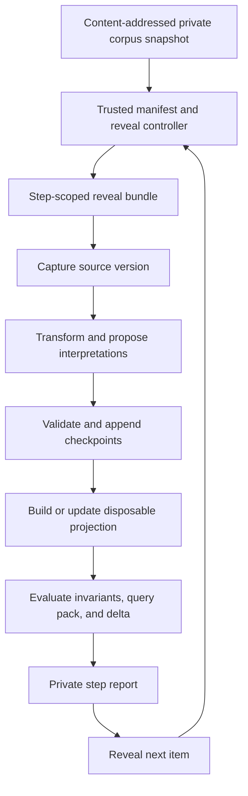

# Corpus Replay Experiment Harness

> **Status:** Non-normative experiment design. Its Issue #6 private execution
> path stopped on 2026-07-21 before an admissible frozen contract or evaluated
> run. It is retained as design history, not current execution authority.
>
> **Created:** 2026-07-12.
>
> **Related work:** [Issue #6 — stopped local future-reveal corpus replay
> harness](https://github.com/asukhodko/graphtruth/issues/6); [Issue #24 — current
> public Python annotation-semantics sequential
> experiment](https://github.com/asukhodko/graphtruth/issues/24).
>
> **Authority / promotion:** This draft describes a Zone 3 laboratory and a
> reversible dogfood method. Its file layouts, manifests, commands, metrics,
> states, and names are experimental. They do not define GraphTruth protocol
> semantics, conformance, canonical serialization, or a supported runtime
> contract. Any portable meaning must be earned through examples, dogfood, and
> the RFC process.
>
> **Material provenance:** The future-reveal and replay design was developed in
> the first post-archive planning discussion and then reviewed for experimental
> validity, privacy, ordering bias, model nondeterminism, and operational cost.
> It synthesizes existing GraphTruth principles; it is not a recovered original
> protocol decision.

## Purpose

GraphTruth needs a repeatable way to test algorithms against a real knowledge
history before their accidental behavior hardens into a protocol. A folder of
project documents can provide that history, but only if the experiment preserves
what the system could have known at each step, separates private data from public
fixtures, and records enough state to explain every difference between runs.

The proposed harness treats a frozen project-document corpus as a sequence of
source events. It reveals one source version at a time, checkpoints the ledger
and projections, evaluates the resulting knowledge delta, and can replay the
same sequence under another implementation or configuration.

The first questions are practical:

- Can a small file-first ledger ingest one real workflow without requiring a
  parallel authoritative notebook?
- Does each displayed claim descend to exact evidence?
- Can the system preserve corrections, disagreement, questions, and historical
  views without manufacturing one truth?
- Does a contextual dossier recover useful information that files plus ordinary
  search miss, or reduce the time needed to reconstruct it?
- Can every supported projection be removed and rebuilt?
- Can two algorithm versions be compared without rewriting historical output?
- Does the experiment remain private, bounded, resumable, and understandable?

The governing project process is in [Development](../DEVELOPMENT.md), authority
and data flow in [Architecture](../ARCHITECTURE.md), and the full algorithm
surface in [Algorithm capability map](ALGORITHM-CAPABILITY-MAP.md).

## Why sequential replay rather than bulk import

A bulk import answers only what one configuration produces after seeing the
whole corpus. It conceals when a contradiction first became detectable, whether
a question was useful before its answer appeared, how long stale knowledge
survived, and whether the system depended on future information.

Sequential replay exposes a trajectory:

```text
source prefix k
  → ledger head k
  → projection generation k
  → questions, contradictions, dossiers, and predictions at k
  → reveal source k+1
  → measure confirmation, correction, resolution, surprise, and lag
```

This is especially valuable for active acquisition and causal discipline. A
question or prediction recorded before the next source is revealed is stronger
evidence than a fluent explanation generated after the outcome is visible.

All-at-once processing remains useful as a full-information comparator. It is
not an honest online baseline because it sees the future, and context limits or
heuristics mean that seeing more does not guarantee better output.

## Experimental vocabulary

These terms organize the laboratory only:

- **Corpus snapshot** — an immutable inventory of private source versions used
  by an experiment.
- **Corpus item** — one revealable source version or declared unavailable item.
- **Source family** — items that share material ancestry, such as an ADR, a
  ticket quoting it, and a report derived from both.
- **Reveal order** — the explicit order in which item existence and content
  become visible to the system.
- **Run** — one execution over a corpus snapshot, order, code/configuration, and
  disclosure policy.
- **Step** — processing one newly revealed item against a particular prior
  ledger head.
- **Checkpoint** — a durable description of the input, resulting heads,
  artifacts, diagnostics, and measures for a step.
- **Lane** — a replay policy, such as frozen passive evaluation or an
  interactive correction fork.
- **Query pack** — questions fixed before a run for comparison and regression.
- **Oracle** — withheld objective or human-reviewed evaluation material that is
  never supplied to the algorithm under test.
- **Epistemic delta** — attributable changes in claims, evidence, questions,
  conflict, availability, dossiers, and known limitations between checkpoints.
- **Projection generation** — one isolated build of disposable access state from
  an identified ledger horizon.
- **Reveal controller** — the trusted harness component that alone can read the
  complete snapshot, manifest, reveal schedule, and oracle.
- **System under test (SUT)** — the replaceable pipeline and algorithms that can
  read only the current reveal bundle and the explicitly permitted prior ledger
  horizon.
- **Corpus boundary** — a declared account of what the snapshot covers, what it
  omits, and what knowledge is represented as already known before step one.

None of these names is a proposed Zone 1 record type.

## Future-reveal invariant

At step `k`, the system under test receives only the first `k` declared items.
It must not receive:

- future source bytes;
- future filenames or directory names;
- future item counts when the real workflow would not reveal them;
- oracle answers or required evidence;
- later corrections, reviews, outcomes, or source metadata;
- summaries generated from the complete corpus.

Names can leak answers: `ADR-042-rejected.md`, `postmortem-root-cause.md`, or a
future owner directory may disclose material knowledge before content is read.
The runner should expose an opaque item identity at reveal time and map it to the
private manifest outside the algorithm boundary.

This is a security boundary, not a convention. The reveal controller runs
outside the SUT and creates a step-scoped reveal bundle containing only the
current opaque ID, current source bytes, permitted metadata, and the identified
prior ledger head. The SUT runs in a separate process or sandbox whose filesystem
view contains only that bundle, its isolated work directory, and the permitted
ledger horizon. It cannot read the corpus root, complete manifest, oracle,
controller state, reports from later steps, or sibling reveal bundles. Network,
tool, and credential access follows the run policy and defaults to denied.

The harness records attempted reads at this boundary. Negative fixtures place
canary answers in future filenames, directory names, manifest fields, and oracle
files; any observation of a canary fails the run. Destroying or unmounting a
bundle after its checkpoint prevents an accidental later scan from broadening
the recorded input.

If the true chronology is unknown, filesystem order and modification time must
not masquerade as event time. The run is then labeled a synthetic stream with an
explicit chosen order.

## High-level architecture



The architecture has five separable components:

1. **Corpus snapshotter** inventories and freezes input without interpreting it.
2. **Reveal controller** exposes exactly one permitted item through an isolated
   bundle, records order, and keeps the complete manifest and oracle outside the
   SUT boundary.
3. **Pipeline runner** executes capture, candidate generation, validation, and
   append operations idempotently.
4. **Projection coordinator** creates an isolated generation and selects it only
   after declared validation succeeds.
5. **Evaluator/reporter** uses withheld judgments and fixed queries without
   feeding their answers back into the frozen lane.

The harness should depend on public runtime interfaces rather than reach into
one index or model implementation. A replacement algorithm should be able to
participate by implementing a capability boundary, not by copying the runner.

## Physical privacy boundary

Real sources, private canonical records, oracle annotations, model traffic,
embeddings, logs, and reports remain outside the public repository. Current
ignored paths are documented in [`.gitignore`](../../.gitignore).

A candidate local layout is:

```text
dogfood/project-x/
  snapshot/                     # content-addressed copies or one atomic Git tree
  controller/
    corpus.yaml                 # complete private manifest; controller-only
    oracle/                     # withheld material; evaluator-only
    reveal/                     # ephemeral step bundle mount points
  vaults/
    run-001/                    # experimental canonical history for this run

.graphtruth/experiments/
  run-001/
    run.json
    steps/
      000001/
        input.json
        ledger-head.json
        projection-manifest.json
        delta.json
        metrics.json
        report.md
    summary.json
```

The snapshot is immutable for the run and physically separate from run output.
Read-only references to mutable originals are not a frozen snapshot. A file
watcher must never ingest its own reports, projections, prompts, or generated
documentation. The SUT account or sandbox cannot traverse `snapshot/` or
`controller/`; the controller grants it only the current reveal bundle.

Public tests use a separately authored synthetic twin under `examples/`; they
never depend on the private tree. Public reports, fixtures, charts, counts,
digests, timings, and failure examples are generated from that synthetic twin.
Private-run reports and metrics remain private rather than being copied,
aggregated, pseudonymized, or merely redacted for publication. Any future
exception needs a separate disclosure review because rare counts, hashes,
timings, and failure shapes can re-identify a project.

Encrypted storage and backups may be appropriate for the private directory, but
encryption does not relax access, logging, disclosure, or deletion discipline.

## Corpus snapshot and manifest

### Inventory behavior

The snapshotter should:

- reject path traversal and symlinks leaving the declared root;
- reject device nodes, sockets, FIFOs, and other non-regular inputs;
- allowlist media types and parser profiles;
- bound file size, recursion, archive expansion, and total corpus size;
- read inputs without modifying access or modification metadata where feasible;
- compute a content digest and byte size;
- preserve source-system and version identity when available;
- detect exact duplicates and record near-duplicate or ancestry candidates;
- represent unsupported, inaccessible, deleted, redacted, and intentionally
  omitted items explicitly;
- produce a deterministic inventory digest;
- avoid placing raw excerpts in ordinary logs or errors.

Freezing is an atomic acquisition operation. A plain-folder snapshotter reads
metadata, copies bytes into content-addressed storage, hashes the copy, and then
rechecks the original metadata and bytes; a concurrent change fails or retries
the whole snapshot instead of producing a mixed horizon. A Git-backed snapshot
uses one identified tree and explicitly handles any dirty state before the run.
Immediately before each reveal, the controller rehashes the frozen object and
compares size, media type, and digest with the manifest. A mismatch fails the
run; it never becomes a silent new source version.

For a Git-backed document repository, commits, trees, blobs, and declared dirty
snapshots provide stronger version evidence than copied current files. For a
plain folder, the operator supplies ordering and version lineage explicitly.

### Candidate manifest shape

```yaml
corpus_id: project-x-2026-07-12
created_at: 2026-07-12T08:00:00Z
inventory_digest: sha256:...
corpus_boundary:
  initial_ledger_head: ledger:known-before-start
  coverage: project-x decision-007 retained Markdown lineage
  exclusions:
    - chat messages not retained by the project
    - undocumented participant memory
  left_censored: true
items:
  - item_id: item-001
    logical_path: decisions/adr-001.md
    digest: sha256:...
    size_bytes: 18422
    media_type: text/markdown
    source_family: decision-007
    source_version: 1
    parent_version: null
    source_times:
      authored_at: 2026-04-03T10:55:00Z
      published_at: 2026-04-03T11:20:00Z
      available_to_project_at: 2026-04-03T11:20:00Z
      first_observed_at: 2026-04-04T08:10:00Z
      claimed_valid_from: 2026-04-05T00:00:00Z
      basis: repository-and-review-record
      uncertainty: minute
    reveal_order: 1
    sensitivity: confidential
    processing_permission: local-deterministic-only
```

This shape is illustrative. A production manifest must not embed a private path
or label into a report destined for publication.

The initial ledger head may be empty, but that is a declared left-censored
experiment—not evidence that participants knew nothing before the first retained
document. Coverage and exclusions make every contradiction, dark-zone, recall,
and dossier result explicitly relative to this corpus boundary. Authored or
valid time, publication or availability time, first-observed time, and actual
reveal/recorded time are separate; absent or uncertain values remain absent or
uncertain. The actual reveal time belongs to the step checkpoint, not the corpus
manifest. Baseline and GraphTruth runs receive the same initial horizon.

### Source ancestry

Exact-byte deduplication is insufficient. Project documents often quote or
summarize the same original decision. The experiment should retain candidate
relations such as copy, quotation, translation, summary, template ancestry, and
shared upstream evidence.

Metrics should report both naïve occurrence counts and ancestry-adjusted support.
Copied descendants of one origin must not cross development and validation
splits or masquerade as independent corroboration. Where feasible, independence
is assessed per claim and evidence span: a descendant may repeat one premise yet
add genuinely independent observation for another.

## Run identity and reproducibility

Every run records at least:

- run ID, parent/fork run, lane, start/end time, and operator;
- corpus inventory digest and reveal-order digest;
- code revision and build identity;
- runtime, parser, transformer, validator, and projection versions;
- model, provider, prompt/template, sampling configuration, seed, and tool
  versions where applicable;
- named policy, thresholds, feature flags, and configuration digest;
- environment or container identity and relevant hardware class;
- network, telemetry, disclosure, retention, and budget policy;
- query-pack and oracle versions;
- baseline identity;
- known nondeterminism and unsupported semantics.

A historical run is not rewritten after an algorithm upgrade. The new algorithm
gets a new run from the same frozen input or a shadow run from an identified
ledger horizon.

Exact model bytes or provider behavior may be unavailable later. The run states
that limitation instead of claiming perfect reproducibility.

## Per-document state machine

A candidate step state machine is:

```text
pending
  → revealed
  → captured
  → transformed
  → candidates-produced
  → source-checkpoint-appended
  → interpretation-checkpoint-appended
  → projection-built
  → evaluated
  → reported
```

Explicit failure or pause states include:

```text
unsupported
quarantined
awaiting-review
budget-exhausted
failed-retryable
failed-terminal
cancelled
```

Capture and interpretation are distinct. The source version can be retained even
when parsing fails. Candidate interpretations can be rerun later without making
the source appear newly observed. An interactive correction appends another
record or checkpoint; it does not edit a previous run step.

Idempotency is checked at every transition. Retrying a completed step must not
duplicate canonical events, candidate identities, external actions, or costs
that the run claims are exactly-once.

## Per-step checkpoint

Each checkpoint should contain or reference:

- run and step IDs;
- opaque item ID, source digest, and permitted source metadata;
- prior and resulting ledger heads;
- source-capture and interpretation bundle/commit IDs;
- algorithm and configuration identities;
- input and output record IDs;
- evidence-alignment and unsupported-field summaries;
- projection generation, input frontier, builder, and validation state;
- diagnostics, omissions, retries, and quarantine decisions;
- elapsed time, tokens, monetary cost, storage, and human-review time;
- epistemic delta;
- fixed-query results executed at this checkpoint;
- review or correction records in an interactive fork;
- integrity result and resume token.

The checkpoint should remain useful when projection contents and external models
are unavailable.

## Artifact and authority classification

| Artifact | Candidate retention | Epistemic meaning |
| --- | --- | --- |
| Private source snapshot | Canonical input for declared run scope | Evidence source, not truth |
| Corpus manifest | Canonical experiment input | Inventory and reveal contract |
| Captured source event | Canonical experimental history | Source became visible to the run |
| Extraction or resolution output | Candidate or retained analysis | Attributed proposal only |
| Human correction | Canonical interactive-fork record | Attributed correction, not global truth |
| Acceptance decision | Only through explicit authorized action | Purpose- and policy-scoped decision |
| Projection generation | Disposable | Access acceleration with declared semantics |
| Raw model response | Private operational/analysis artifact | No authority; retention is policy-dependent |
| Oracle annotation | Evaluation-only private artifact | Withheld judgment, not pipeline input |
| Step report | Private experiment artifact | Explanation of one run checkpoint |
| Public result | Generated only from the synthetic twin | No private-run artifact or metric copied into it |

The durable/disposable axis and observed/source-derived/inferred axis remain
independent, as required by [Architecture](../ARCHITECTURE.md).

## Candidate command surface

The first runner may expose an explicitly experimental CLI:

```text
graphtruth experiment snapshot <source-folder> --manifest <private-path>
graphtruth experiment inspect <manifest>
graphtruth experiment run <manifest> --mode step --network deny
graphtruth experiment next <run-id>
graphtruth experiment replay <manifest> --from-empty
graphtruth experiment fork <run-id> --interactive
graphtruth experiment compare <run-a> <run-b>
graphtruth experiment verify-rebuild <run-id>
graphtruth experiment report <run-id>
```

The command names are placeholders. Basic reading, validation, and recovery must
not eventually require the experiment daemon or its internal database.
These are controller commands: accepting `<manifest>` does not pass that manifest
to the SUT process. The controller materializes one scoped bundle and launches
the worker with only that bundle.

## Observing knowledge change

After each item, the runner emits a compact delta rather than a full graph dump.
Candidate sections include:

1. source added, updated, duplicated, inaccessible, or unsupported;
2. new or changed candidate mentions, propositions, assertions, and questions;
3. evidence locator validity and material-field grounding;
4. identity or predicate mapping candidates;
5. new support, challenge, common ancestry, or circularity warning;
6. newly detectable, resolved, reopened, or stale contradiction and dark-zone
   candidates;
7. current/as-of dossier semantic changes;
8. new omissions, unsupported semantics, and authorization limits;
9. validator, projection, integrity, and privacy diagnostics;
10. latency, cost, storage, and human-review measures.

Full query-pack execution after every document can become quadratic. Cheap
invariants run on every step. Full dossiers run at predetermined checkpoints and
when a material event occurs: contradiction, question resolution, supersession,
redaction, policy change, or projection replacement.

## Replay lanes

### Frozen passive lane

The complete run proceeds without human corrections or tuning. Review happens
after the final step. This lane supports fair comparison because observing an
intermediate failure does not change later algorithm behavior.

An operator may stop for a safety violation, but the run is then failed rather
than silently resumed under a changed prompt or policy.

### Interactive fork

An identified frozen-run checkpoint is forked. The user may correct candidates,
record assessments, answer questions, or issue an authorized purpose-scoped
decision. Every intervention is append-only and timed.

This lane measures:

- correction and review cost;
- whether proposed knowledge is understandable;
- whether a corrected state improves later retrieval;
- whether the user can stop maintaining a parallel notebook;
- whether feedback is incorrectly treated as truth or training labels.

The frozen and interactive results are not pooled as if they were independent
observations.

## Eventual experiment suite

Sections A–I define the coverage expected before calling the harness mature.
They are not all acceptance criteria for the first time-boxed walking skeleton;
that exact subset is declared below.

### A. Deterministic capture and rebuild

Inventory, capture, manual records, validation, one exact/lexical projection,
deletion, and clean rebuild. This establishes the walking skeleton.

### B. Chronological future reveal

Process the historically justified order. Record questions, conflicts, dossiers,
and optional predictions before revealing the next item.

### C. Duplicate and idempotency replay

Repeat, rename, copy, and redeliver sources. Verify no hidden multiplicative
support or canonical duplication.

### D. Order robustness and semantic convergence

This lane tests whether GraphTruth reconstructs knowledge from source meaning,
provenance, lineage, and time rather than borrowing an accidental narrative from
the arrival order. It complements chronological future reveal; it does not
replace it. Historical order remains the honest lane for studying what could
have been known and asked at each real horizon.

Freeze a closed corpus, its source and event times, version lineage, coverage,
task pack, oracle constraints, baselines, budgets, and severe errors before any
evaluated run. Start every ordering from an empty isolated run: no ledger,
projection, model state, or cached result may carry over. Human-scored results
count as independent only where first exposure or independent operators prevent
operator-memory carry-over; later exposures remain diagnostic. The system sees
only the current reveal bundle and never receives future filenames, counts,
inventory, or oracle material.

For a three-to-five-item laboratory corpus of distinct source versions, execute
all `n!` unique permutations: there are only 6, 24, or 120 respectively. Freeze
the generator, enumeration rule, expected count, complete permutation-list
digest, and run denominator. A retry is permitted only for a predeclared
controller or infrastructure failure before the SUT receives its first reveal;
both attempt identities remain recorded. A timeout, budget exhaustion, SUT
crash, semantic failure, or severe error remains the result of that permutation
slot. Cross-run state contamination, future leakage, or another boundary breach
invalidates the entire suite generation and requires a new suite identity; it
cannot be repaired into a pass. Larger corpora use a frozen suite containing at
least:

- the historically justified order;
- reverse order;
- several seeded random permutations;
- dependency-adversarial orders, such as correction before corrected claim,
  derivative before ancestor, duplicate copies separated widely, and decisive
  bridge or counterevidence last.

Record the exact permutation or seed with the run identity. Keep at least four
time axes independent: valid/event time, publication/availability time,
arrival/reveal position in this permutation, and GraphTruth recorded time.
Random arrival changes only the last two. It never changes event time, source
version, authority, provenance, or version precedence. A late-arriving old claim
must not overwrite an earlier-arriving correction merely because it was ingested
last.

Evaluate two surfaces separately.

#### Terminal semantic convergence

After the complete corpus has been revealed:

- every retained source byte, identity, locator, provenance relation, and
  declared time remains reachable;
- deterministic order-independent semantics match a clean rebuild after the
  declared normalization and stable-ID alignment; byte-identical ledgers and
  identical arrival histories are not required;
- corrections, support, contradiction, source ancestry, uncertainty, and
  permanently unresolved gaps have the same material interpretation wherever
  the evidence justifies convergence. Normalization must not discard qualifiers,
  negation, scope, authority, provenance, or valid-time differences;
- heuristic organizations stay within frozen task-level and structural
  tolerances. Several purpose-relative structures may be acceptable; the oracle
  specifies required and forbidden relations and task outcomes rather than one
  gold graph;
- every frozen query can retrieve its decisive evidence and counterevidence at
  least as reliably as the honest source-files-plus-search baseline.

Do not optimize connected-component count, edge density, or production of one
large cluster. A high-quality result may contain several regions, uncertain
bridges, isolated fragments, contradictions, and explicit dark zones. The target
is justified connectivity with bounded false merges and false relations, not
maximum connectivity.

#### Trajectory quality

Terminal agreement can hide a dangerous online path. At every reveal, measure:

- correct abstention before the required evidence exists;
- unsupported assertions, false merges, and false causal or temporal order;
- time to connect newly available support or counterevidence;
- contradiction, correction, supersession, and stale-state resolution lag;
- whether the system asks a discriminating question instead of inventing a
  bridge;
- retraction, repair, review, and capture cost caused by a bad intermediate
  interpretation.

Measure answer and detection lag from the earliest prefix at which the required
evidence is objectively available in that permutation, not from one absolute
document position copied across orders.

Intermediate histories may legitimately differ because different evidence was
available. Preserve them; do not rewrite every run into the same retrospective
story.

#### Non-degradation decision

"Not worse than the source set" is evaluated through a frozen query and task
pack, not through visual graph appeal. Use distinct references without confusing
their authority:

- raw files plus literal search as the primary automated non-inferiority baseline
  over the complete factorial task matrix;
- the ordinary current workflow with its real editor and navigation tools as the
  primary human utility comparator over a frozen first-exposure subset;
- optionally, all files visible at once as a labeled diagnostic comparator,
  never an online baseline or a requirement for D to pass;
- a clean batch GraphTruth build as an internal convergence reference, never
  evidence of user value.

Every honest baseline receives the same source horizon, time, expertise,
assistance, and first-exposure boundary. One human cannot provide 120 independent
first exposures; use independent operators or a frozen counterbalanced subset
for human comparison while automated hard gates still cover every permutation.
The subset supports conclusions only about its registered cells; it cannot prove
human non-inferiority across unobserved permutations.

Every permutation must pass zero-tolerance source-retention, provenance,
future-leak, authority, and severe-error gates. Deterministic invariants use
per-permutation pass/fail. Heuristic and utility measures report their full
distribution and worst tail, not only the mean; one catastrophic ordering cannot
be averaged away. Freeze non-inferiority margins for correctness, calibrated
abstention, decisive-evidence and counterevidence recall, false merge/relation
rates, answer and verification time, review cost, and capture tax before the
first run.

For stochastic heuristics, freeze the same seed schedule for every permutation
or test repeatability separately. Required semantic and utility floors apply to
every run and seed slot; order sensitivity must not be hidden inside model
randomness.

Freeze denominators independently. Let `P` be the permutation count (`n!` for
three-to-five items), `S` the seed-slot count, `T` the eligible task count, and
`A` the automated evaluated-arm count. Record at least the permutation
denominator `P`, execution denominator `P × S`, and primary automated evaluation
denominator `P × S × T × A`, with missing, invalid, and severe-error treatment
for each axis. Treat that last value as the total cell inventory: freeze the
per-arm and paired-comparison denominator `P × S × T` separately so pooled arm
completeness cannot masquerade as the comparison statistic. Human first-exposure
cells have a separate frozen denominator.

The lane passes only when the complete registered permutation denominator is
accounted for, all hard gates hold, deterministic terminal semantics converge
wherever declared, every heuristic run remains above its frozen quality floor,
and GraphTruth is non-inferior to raw files plus search on the complete automated
primary endpoint. Human utility claims are limited to the frozen first-exposure
subset. A quality tie with materially greater total human or system cost is
evidence to shrink or stop, not a hidden success. A `keep` decision additionally
requires at least one frozen task-level benefit over its declared value
comparator without regression elsewhere, or equal correctness with lower
answer-plus-review cost after capture tax.

### E. Full-information comparator

Run access and analysis with the full corpus visible. Label it a full-information
comparator, never an online competitor. It is only a potential upper bound:
context limits, ranking, or heuristic interference can make an algorithm perform
worse when everything is visible at once.

### F. Adversarial, privacy, and redaction

Include prompt injection, secrets, malicious links, unsupported executable
content, path traversal, duplicate ancestry, authorization-limited evidence,
redaction, and deletion propagation.

### G. Crash, resume, and clean rebuild

Inject interruption before and after each declared publication boundary. Resume
or discard safely, then delete all supported projections and rebuild them.

### H. Baseline crossover

Answer the same blind query pack using GraphTruth and Markdown plus `rg`.
Compare time, correctness, completeness, evidence inspection, counterevidence,
and correction effort. A later raw-RAG baseline must use the same model and
budget where comparison requires it.

Carry-over can invalidate a solo crossover because the first interface teaches
the reviewer the answer. Prefer independent reviewers. Otherwise partition
matched queries or source families, randomize and counterbalance `AB`/`BA`, and
use only each reviewer's first exposure for the primary comparison; later
crossovers are diagnostic. Equalize corpus and initial-ledger horizon, permitted
tools, expertise, query and answer rubric, time, compute, and disclosure budget.
Report one-time snapshot/ingest/annotation/setup cost separately from marginal
maintenance and query cost.

Before any answer is seen, the run protocol freezes its primary endpoint,
eligible-query denominator, severe-error classes, per-query rubric, decision
threshold, uncertainty method, exclusions, and missing-data handling. Report all
eligible queries, not only wins. A useful finding may explain a result, but one
cherry-picked dossier cannot pass a many-query comparison.

### I. Hidden-domain topology shock

Exercise continuous domain-structure actualization as a successor experiment,
not as an expansion of the first walking skeleton. Interleave at least three
latent domains while withholding their names, count, membership labels, future
filenames, and oracle topology from the SUT. Include:

- records with zero, one, and several plausible memberships;
- a genuinely new domain that should remain unclassified until supported;
- vocabulary or sense drift;
- a withheld missing link whose reveal should cause a material bridge,
  reparenting, split, merge, or overlapping reorganization;
- stable-phase distractors and a late-recorded source that claims an older
  valid-time structure;
- an independent confirmation and a later counterexample that prevents or
  reverses an over-merge;
- fixed cross-domain queries, decisive counterevidence, and at least one
  discriminating question the system could ask before the bridge arrives.

The evaluation oracle is not one gold tree. It declares required and forbidden
memberships, acceptable alternative purpose-relative structures, intended
lineage events, bridge and counterexample evidence, and competency queries.
Give every online comparator the same step-scoped bundle and predeclared human,
time, compute, and review budgets. Compare raw Markdown plus `rg`; online
human-maintained facets/tags; a purely incremental candidate; scheduled clean
rediscovery; and a hybrid that triggers a clean candidate after structural
surprise. Keep a full-information curated topology only as a labeled comparator.
Report setup/annotation separately from per-item maintenance, query, and review
cost. Run historical, bridge-early, bridge-late, and shuffled orders.

Separate two axes: incremental-versus-clean maintenance for one fixed method and
its declared deterministic semantics, and performance/path-dependence comparison
among different heuristic methods. Only the first can have a deterministic
semantic-equivalence gate; heuristic structures use predeclared material-
divergence and utility criteria.

Every checkpoint records the selected topology generation, predecessor, input
horizon, claimed valid-time scope and uncertainty, memberships, lineage
proposals, change explanation, impact and privacy diff, dependent projection
frontier, and stable-versus-shock metrics. Verify earlier generations remain
reconstructible; distinguish the then-visible topology from a later topology
applied retrospectively to the same old corpus horizon; and ensure late-recorded
historical evidence revises the appropriate valid interval rather than being
reported as a present-world change.

Before reveal, freeze the lineage-aligned structural-displacement statistic over
membership/relation change, competency-query delta, and invalidation reach; its
stable/null calibration and shock threshold; model/features/configuration;
false-alarm budget; source-family ablation; settling/reversal criteria; and
allowed heuristic divergence. Distractor arrivals are negative controls.

Add a simulated-acquisition fork. Only a topology-discriminating question that
meets frozen answer criteria, policy, authorization, and budget may reveal a
minimal withheld answer. The responder cannot disclose labels, counts, future
metadata, or unrelated oracle structure. Compare with the passive scheduled
lane and measure discovery advance, realized information gain, wrong/redundant
questions, interruption cost, and privacy exposure.

Zero-tolerance failures include future-label leakage, forced confident
classification, implicit acceptance, canonical or historical rewrite,
authorization leakage through domain existence or counts, a domain filter hiding
decisive evidence, and deterministic incremental semantics for the same fixed
method that cannot match a clean rebuild. Candidate measures include discovery
delay, abstention and soft
membership quality, topology-lineage accuracy, stable-period churn,
structural-shock delay and fragility, cross-domain and counterevidence recall,
query value, negative transfer, and review cost.

Detailed design and learning remain in
[Issue #8](https://github.com/asukhodko/graphtruth/issues/8), `GT-D037`–`GT-D039`,
and [Ontology and document views](ONTOLOGY-AND-DOCUMENT-VIEWS.md). Continuous
event-driven invalidation does not contradict the first experiment's non-goal of
full-corpus reanalysis after every item; bounded incremental work plus scheduled
or shock-triggered clean comparison is the intended distinction.

## Order comparison and convergence

Recorded history is order-dependent by definition. A randomized run must not be
expected to reproduce the historical recorded-time trajectory.

Comparisons should separate:

- **trajectory:** earliest discoverable step, detection lag, resolution lag,
  false persistence, and question usefulness;
- **terminal deterministic semantics:** normalized records, evidence references,
  lifecycle state, and exact query results that should converge;
- **allowed heuristic variation:** IDs local to a run, scores, rankings,
  generated text, and nondeterministic candidate sets.

Generated IDs, recorded times, and projection-local identifiers are normalized
or excluded when they are not semantically comparable.

## Query pack and evaluation oracle

Before the first run, record questions that occur in the real workflow, for
example:

- What is the current decision and its exact evidence?
- Why was it made, by whom, and under what constraints?
- Which earlier statement was superseded, and when did the ledger learn that?
- Which sources disagree, and are they independent?
- What remained unknown at a selected historical horizon?
- Which outcome or observation later tested the original rationale?
- What evidence would change the current decision?

The evaluator stores required evidence and acceptable/uncertain answers outside
the pipeline. Answers are annotated before viewing GraphTruth output where
possible. Reviewer disagreement and adjudication are retained.

Evaluation distinguishes:

1. **Objective capture truth:** bytes, digests, selectors, source versions, and
   reveal order.
2. **Human-reviewed epistemic judgments:** claim boundaries, identity,
   contradiction, relevance, and sufficiency, including disagreement.
3. **Utility outcome:** whether the result improved a real decision or reduced
   reconstruction effort.

A source document is not ground truth merely because it exists or is newest.

## Dataset splits and leakage control

Random chunk splits are invalid for this experiment. Split by project, source
family, decision lineage, and time:

- development: synthetic fixtures plus a small private pilot;
- frozen validation: distinct decision/source families;
- blind temporal test: sources created after configuration freeze;
- challenge: injection, redaction, duplicates, out-of-order delivery, parser
  failure, and crashes.

Copied descendants of one origin stay in one split. Prompt, policy, threshold,
and query-pack changes after viewing validation output create a new experiment
generation.

Pretraining leakage for public documents may be impossible to eliminate. It is
recorded as a limitation and never confused with source-grounded performance.

## Metrics

### Capture and integrity

- source loss and duplicate rates;
- manifest and locator validity;
- partial-snapshot and unsupported-state accuracy;
- idempotent re-ingestion;
- interrupted-step recovery;
- canonical and projection integrity.

### Evidence and interpretation

- material fields grounded to exact evidence;
- unsupported-field and false-citation rates;
- claimant, negation, qualifier, unit, scope, and time accuracy;
- correction minutes and edit operations;
- false merge and predicate-mapping failures;
- copied-source independence errors.

### Contradiction and questions

- precision/recall by declared contradiction subtype;
- severe false-positive rate;
- question precision, actionability, and interruption cost;
- question creation-to-resolution and reopen lag;
- realized information gain where measurable;
- stale candidate lifetime after supersession.

### Retrieval and dossiers

- exact and lexical recall at a fixed budget;
- decisive-counterevidence recall;
- dossier claim-to-evidence traceability;
- revision/as-of correctness;
- explicit omission and authorization-limit reporting;
- useful context missed by the baseline;
- time and actions needed to answer the query pack.

### Resilience and replacement

- clean-rebuild semantic equality;
- incremental-versus-clean exact projection equivalence;
- percentage of eligible terminal semantics invariant across orderings;
- model/prompt run-to-run candidate and span agreement;
- stale projection and redaction residue;
- behavior with a provider or index removed.

### Cost and human burden

- latency, tokens, money, energy class, and storage per item;
- full-run and per-useful-finding cost;
- review, correction, and query minutes;
- fatigue position and skipped/deferred review;
- marginal validated information gain per unit cost.

No aggregate score can compensate for a privacy leak, lost history, implicit
acceptance, or an unsupported confident claim.

## Model nondeterminism and algorithm comparison

The deterministic manual/exact pipeline is the baseline. For a stochastic
stage:

- record model/provider/version, prompt, code, configuration, seed, sampling,
  ledger head, and authorized input;
- repeat at least three times on a stratified small subset as a smoke-test floor,
  not as statistical evidence;
- compare normalized candidate sets, evidence-span agreement, severe-error
  union, calibration, rank variance, and correction effort;
- report paired item- and source-family-level uncertainty when the sample permits;
- keep cold and warm/cache measurements separate;
- shadow-run old and new algorithms against the same input snapshot;
- retain historical consequential output instead of rewriting it after an
  upgrade.

Byte-identical output is not required unless a deterministic capability contract
promises it.

## Review-fatigue controls

Do not ask a reviewer to inspect every generated object after every step.

Review:

- every severe safety, authority, or integrity result;
- high-impact disagreement and unsupported claim candidates;
- a stratified random sample of other outputs;
- no-change sentinels to detect reviewer expectation bias;
- an inter-rater subset when practical.

Use time-capped sessions and blind/randomized A/B presentation. `Skip`, `defer`,
and `insufficient evidence` are not negative correctness labels. Track accuracy
and correction effort by review position because fatigue can make later labels
worse.

## Security and privacy controls

Source content is untrusted data. The default experiment profile should:

- deny network and telemetry;
- use local deterministic parsing and manual candidate records;
- run parsers and model workers without shell, tool, credential, or action
  capabilities;
- validate structured output before any append;
- prevent document text from changing system prompts, policies, permissions,
  acceptance, publication, or reveal order;
- minimize ordinary logs and sanitize paths, excerpts, prompts, and errors;
- keep private embeddings, caches, and raw model responses within the private
  retention boundary;
- scan and quarantine likely secrets or malicious content without treating a
  scan as proof of safety;
- verify redaction and deletion closure across canonical references,
  projections, caches, prompts, logs, backups, and publications;
- enforce hard token, money, time, storage, and review budgets;
- cancel and checkpoint idempotently at a budget or safety boundary.

Any remote provider requires an explicit disclosure manifest naming provider,
purpose, permitted data classes, preprocessing, retention assumption, and
configuration. The first remote run should be a sanitized shadow using synthetic
or explicitly approved material.

## Automation ladder

### S0 — Inventory only

Hash and inventory the folder, verify paths and source versions, and emit no
knowledge candidates.

### S1 — Deterministic local and manual

Parse allowlisted text locally, retain exact evidence, use manual records, build
one exact/lexical projection, and exercise correction and rebuild.

### S2 — Local model proposals

Add a local model in a sandbox with no tools or network. It emits attributable
candidate records only.

### S3 — Sanitized remote shadow

Send only explicitly authorized and minimized material under a recorded
disclosure policy. Compare with the local/manual lane; do not make remote output
the only durable interpretation.

### S4 — Simulated active acquisition

Let the system rank questions or request the next item from a withheld local set.
The harness, not the model, controls reveal and records whether the selection
resolved uncertainty. No real person, service, or intervention is contacted.

Each transition has a separate privacy, authority, usefulness, and cost gate.

## Executable preflight gate

No real or private corpus enters the walking skeleton until two independent
parts of the preflight gate pass.

First, `./tooling/preflight` statically validates the checked-in
[public synthetic preflight pack](../../examples/experiments/preflight/). The
ordinary `./tooling/check` quality gate runs that validation plus negative
mutations against the frozen contract. Together they catch incomplete or
internally inconsistent manifests, digests, tasks, or policy declarations. They
do not execute a reveal controller, create an operating-system sandbox, test
egress, prove non-disclosure, or exercise crash/resume and deletion.

Second, the actual runner must complete a separately recorded end-to-end
synthetic dress rehearsal inside the same isolation shape intended for the real
run. A human signs off the observed boundary checks and deletion closure. Both
parts are non-normative Zone 3 laboratory work, not protocol conformance or
evidence that an arbitrary environment is safe.

Before execution, freeze one reviewable pack containing at least:

- the synthetic corpus and its explicit reveal order;
- a corpus manifest with digests, source-family lineage, sensitivity, allowed
  use, exclusions, and the declared pre-step-one knowledge boundary;
- a run card with the hypothesis, primary endpoint, denominator, severe-error
  classes, budgets, missing-data rules, and `keep / shrink / stop` decision;
- a task pack, separately withheld oracle, answer rubric, and baseline policy;
- the data-handling matrix, sandbox profile, retention/deletion policy, and
  incident-response instructions;
- append-only deviation and failure diaries.

The frozen pack receives an identity and digest before reveal. Any later change
to its corpus, order, oracle, query tasks, thresholds, policy, configuration, or
code creates a new pack or run identity; it cannot silently repair the active
run. The rehearsal must at minimum exercise future-filename, manifest, and
oracle canaries; input/output isolation; rejected unsafe paths; deterministic
inventory; first-item reveal; abort/resume; and deletion followed by a clean
rerun. A failed zero-tolerance boundary invalidates the rehearsal rather than
becoming an accepted deviation.

Human information leakage is part of the boundary. Record who curated the
corpus, operated the SUT, prepared the oracle, used the baseline, and scored the
answers, plus each person's prior familiarity with the tasks. Keep the oracle
unavailable to both the SUT and first-exposure baseline operator. Prefer
independent roles; when one person must hold several roles, freeze materials
before output is viewed, use only first exposure for the primary comparison,
record `known / vaguely remembered / forgotten / unknown` per task, and label
the resulting comparison exploratory.

Real data is admitted only after the static synthetic command and the recorded
runtime rehearsal pass, the run-specific pack is frozen, and privacy,
authorization, retention, sandbox, and role checks are explicitly signed off.
The gate must be repeated when a relevant boundary, runner, fixture, or policy
changes. Passing it authorizes only the already bounded S0–S1 experiment; it
does not add capabilities, enlarge the 3–5 item pilot, introduce a model, or
promote any experimental format into Zones 1 or 2.

The static pack and validator are tracked in
[Issue #10 — Experiment preflight pack](https://github.com/asukhodko/graphtruth/issues/10).
The runner and observed runtime rehearsal remain in
[Issue #6 — Corpus replay walking skeleton](https://github.com/asukhodko/graphtruth/issues/6).

## First walking-skeleton experiment

### Corpus

Start with 3–5 Markdown documents from one private technical decision or incident
lineage. Expand to 10–20 only after one end-to-end run succeeds inside the same
time box:

- initial context and alternatives;
- decision or plan;
- copied or stale documentation;
- contradictory source;
- implementation or deployment observation;
- incident or unexpected result;
- correction or supersession;
- current decision and at least one unresolved question.

Publish only an independently written synthetic twin that preserves the failure
shape without preserving private wording, values, identities, or structure that
can re-identify the source.

Corpus selection, boundary/exclusion declaration, and the first query pack count
against the time box. They are experiment work, not free prerequisites.

### Minimum implementation

- manifest snapshot and validation;
- deterministic one-item reveal;
- source checkpoint with exact evidence locators;
- manual or deterministic candidate-record input;
- provisional private file vault;
- one disposable lexical projection;
- current and as-of deterministic dossier;
- compact delta report;
- idempotent retry and resume;
- projection deletion and clean rebuild;
- frozen query pack and Markdown plus `rg` baseline.

No LLM, embeddings, graph database, universal ontology, multi-writer service,
general UI, or Zone 1 format decision is required.

### Time box

Five working days with a hard stop after two calendar weeks. For this
experiment, one working day is one distinct Europe/Moscow date with material
GraphTruth repository activity on or after the issue was opened. Multiple
events on one date count once; a date with no repository activity counts zero.
The historical counted-date ledger is retained in Issue #6. That experiment
stopped after four of five repo-active dates; its unused nominal day is not
reused. Issue #24 is now the single major WIP item and owns a separate budget.

The first time box covers S0–S1; A; B on 3–5 items; exact-redelivery idempotency
from C; one interruption plus clean rebuild from G; the controller/SUT canary
fixture; and the predeclared first-exposure comparison from H. This establishes
the vertical loop. After that experiment records its evidence, reaches an
explicit `keep`, and closes its WIP, bounded D over the same 3–5 items opens as a
separate successor experiment with a new run card, freeze, owner, and time box.
It must pass before expansion to 10–20 or any claim of order robustness.
Automated invariants use all `n!` permutations; expensive human scoring may use
a frozen representative and worst-order subset. Larger permutation suites, the
optional full-information experiment E, the full adversarial/redaction matrix F,
and exhaustive crash points from G follow only after the relevant keep decision.

Before reveal, write a run card with at least eight eligible query tasks across
three source roles where the corpus allows it. The primary endpoint is the count
of first-exposure tasks completed inside the fixed query budget with a rubric-
acceptable answer, exact evidence, and required counterevidence; the denominator
is every eligible frozen task. A suggested first-run decision threshold is no
severe correctness regression and either two additional successful tasks or a
25% lower median completion time at equal task success. Replace those numbers
only before reveal and explain why. Setup, per-document maintenance, review, and
marginal query time remain separate secondary outcomes.

### Success evidence

- every displayed claim reaches exact retained evidence;
- no future item or metadata is visible early;
- correction and disagreement preserve history;
- repeated ingestion is idempotent;
- current and as-of views differ predictably;
- the lexical projection deletes and rebuilds from retained inputs;
- the predeclared primary endpoint and threshold are reported over every
  eligible query, including uncertainty and failures;
- useful dossiers, contradictions, and questions are reported as explanatory
  evidence rather than a post-hoc substitute for the primary threshold;
- capture and review cost does not force a parallel authoritative notebook;
- expected, observed, and learned evidence is recorded in Issue #6.

### Zero-tolerance failure gates

- private disclosure or unauthorized network/tool action;
- execution of source instructions;
- implicit acceptance or irreversible identity merge;
- lost provenance, evidence, or revision history;
- canonical meaning retained only in a projection;
- non-idempotent replay;
- rebuild corruption or redaction residue.

### Reduction or stop criteria

- Markdown plus `rg` performs as well at materially lower cost;
- capture/review burden exceeds ordinary project-note maintenance;
- success requires a model, database, ontology, or protocol commitment outside
  the time box;
- a safe synthetic twin cannot be created;
- marginal validated information gain stays below the declared cost;
- the time box expires without one complete loop.

## Zone placement

### Zone 1

Unchanged. No manifest, step, command, report, or file layout in this draft is
normative. A portable concept can be promoted only after repeated interoperability
or archival need, concrete examples, an RFC, and conformance evidence.

### Zone 2

Deterministic validators, exact projectors, manifest checks, and rebuild
verifiers may later become core tooling only when they implement accepted
semantics. During this experiment they remain provisional helpers.

### Zone 3

The runner, reveal controller, adapters, parser/model orchestration, projections,
query selection, metrics, reports, privacy configuration, and operational state
belong here.

## Relationship to the design backlog

This experiment is one WIP hypothesis, not an assertion that all related backlog
items are complete. It primarily:

- instantiates the first journey from `GT-D001`;
- uses a minimal scorecard from `GT-D009`;
- probes projection manifests and rebuild from `GT-D014`;
- begins one-source ingestion from `GT-D019`;
- exercises baseline access from `GT-D021`;
- creates an algorithm-replacement substrate for `GT-D025`;
- provides a successor hidden-domain experiment for `GT-D037`–`GT-D039`
  without adding ontology work to the first walking skeleton;
- tests source-snapshot completeness from `GT-D042`;
- prepares answer assimilation from `GT-D049`;
- discovers whether runtime orchestration from `GT-D054` is actually needed.

It does not complete those tasks automatically. Subsequent work should promote
only fields and behaviors demonstrated by the run. The cross-document task owner
remains [Design backlog](DESIGN-BACKLOG.md).

## Historical Issue #6 learning sequence

The sequence below is retained to explain the stopped private design. It is not
authorized work. The current public route is defined by the [starter-corpora
laboratory plan](../../experiments/STARTER-CORPORA-LABORATORY-PLAN.md) and
Issue #24.

1. Run S0 and S1 on the synthetic twin.
2. Run the private frozen chronological lane.
3. Review failures and fork an interactive correction lane.
4. Compare with the baseline query pack.
5. Inject duplicate, order, crash, privacy, and rebuild cases.
6. Record expected, observed, and learned in Issue #6.
7. Keep, revise, shrink, or remove the harness behavior.
8. Only then decide which minimal envelope, addressing, serialization, and vault
   experiments should follow.

At the creation of this draft on 2026-07-12, Issue #6 was the focused experiment
seeded from the recovered archive and linked to the development-loop work. It
later stopped before private execution. All mutable progress and completion
state belongs in GitHub issues rather than this durable methodology document.

## Open questions

1. Should the first corpus be a Git history, a frozen folder, or both?
2. What is the smallest evidence locator sufficient for Markdown without
   prematurely choosing a universal selector?
3. Should capture and interpretation use separate ledger commits in the first
   prototype or only separate bundles within one atomic step?
4. Which exact semantics should converge across reveal-order permutations?
5. How much of a model response deserves private retention for audit?
6. What dossier queries run at every step versus material checkpoints?
7. How should the runner represent a document whose existence was known but
   whose content was inaccessible?
8. How are source-family ancestry candidates reviewed without creating a full
   entity-resolution problem first?
9. Which measures justify continuing beyond Markdown plus `rg`?
10. What private environment and backup policy are sufficient for the first
    dogfood corpus?
11. When does simulated acquisition earn a real, separately authorized external
    action workflow?
12. Which experiment artifacts remain useful after the harness implementation is
    replaced or reaches end of life?

## Explicit non-goals

- defining the GraphTruth protocol or a stable canonical encoding;
- proving universal algorithm quality from one project;
- treating documents, latest versions, model output, or oracle labels as truth;
- autonomous acceptance, identity merge, publication, or external action;
- full-corpus continuous reanalysis after every item;
- storing private corpus material in GitHub, public CI, or public fixtures;
- building a graph/vector database, distributed scheduler, or general UI before
  the first loop demonstrates need;
- claiming that replay makes nondeterministic external models exactly
  reproducible.

The harness succeeds when it makes learning from one real workflow observable,
safe, and comparable—not when it produces the largest graph or the most fluent
report.
