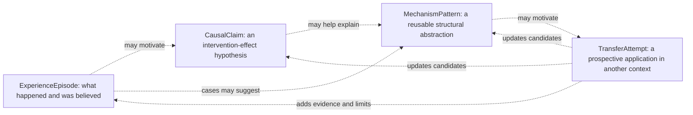

# Experience, Causality, Mechanisms, and Transfer

> **Status:** Recovered design context — non-normative
>
> **Captured:** 2026-07-11
>
> **Authority / Promotion:** This draft preserves product hypotheses and
> candidate profile semantics. `ExperienceEpisode`, `CausalClaim`,
> `MechanismPattern`, and `TransferAttempt` remain candidate future-profile
> roles. Promote any of them only through separate RFCs, versioned specification
> text, schemas, examples, and conformance evidence.
>
> **Material provenance:** The four candidate roles and the experience-to-
> transfer thesis were directly recovered from the session. Detailed record
> shapes, safeguards, and evaluation methods were reconstructed and expanded
> during this archive pass; exact original wording is unavailable.

## Motivation

Knowledge learned through personal action is often easier to reuse than a
conclusion read after the fact. The personal episode contains more than a lesson:
the situation, goal, constraints, uncertainty, alternatives, prediction,
decision, executed action, observation, outcome, surprise, and correction. That
structure helps a person recognize the same mechanism beneath different surface
vocabulary and can enable an elegant transfer rather than a cumbersome solution.

GraphTruth cannot turn reading into lived experience or guarantee invention. It
can, however:

- preserve the path through an experience instead of retaining only the polished
  conclusion;
- keep provenance, temporal sequence, association, rationale, and causation
  distinct;
- reconstruct a decision point without silently inserting hindsight;
- support active replay, prediction, comparison, and safe practice;
- abstract tentative mechanisms with operating and failure conditions;
- retrieve structurally analogous cases across domains;
- record prospective transfer attempts, including failures and surprises;
- use successful and failed application as new evidence rather than proof of a
  universal rule.

The authoritative distinctions are documented in
[`ARCHITECTURE.md`](../ARCHITECTURE.md), especially the separation of
provenance, sequence, association, and causation. The stable intent is in
[`PRINCIPLES.md`](../PRINCIPLES.md), and current terms are in
[`GLOSSARY.md`](../GLOSSARY.md). This draft does not override those documents.

## An epistemic ladder, not an automatic promotion path

The candidate roles form different kinds of record:

No arrow is an automatic promotion:

- an episode records a trajectory but does not prove why the outcome occurred;
- temporal order and association can motivate a causal hypothesis but do not
  establish an intervention effect;
- a causal claim is scoped to its comparator, assumptions, evidence, and model;
- a mechanism pattern is a proposed abstraction, not a context-free law;
- a transfer attempt tests applicability in one target context;
- one successful transfer does not establish universality;
- one failure may reveal a boundary, a bad mapping, poor execution, or an
  incorrect mechanism and should not be overinterpreted either.

## ExperienceEpisode hypothesis

### Candidate episode content

A useful experience episode may need to preserve:

- initial situation and environment;
- goal, success criteria, and stakes;
- constraints, resources, actors, and responsibilities;
- information represented as visible in the ledger at decision time;
- important unknowns and confidence at that time;
- hypotheses and expected mechanisms;
- predictions recorded before the outcome;
- alternatives considered, rejected, or overlooked;
- decision and rationale;
- intended action or intervention;
- action actually executed;
- exposure or intervention actually received by the target;
- observations, measurement methods, and timing;
- outcome relative to goal, baseline, comparator, and prediction;
- surprises, side effects, failures, and missing measurements;
- contemporaneous interpretation;
- later interpretations, corrections, and causal hypotheses;
- exact evidence and source-artifact versions for each material element;
- links to related questions, assertions, assessments, and acceptance decisions.

These fields are deliberately more detailed than a retrospective “lesson
learned.” The exact minimal and optional fields remain open.

### Distinctions inside an episode

The model should not collapse:

- plan into action;
- action into received intervention;
- observation into interpretation;
- outcome into causal effect;
- rationale into the cause of the eventual outcome;
- prediction made beforehand into explanation written afterward;
- information recorded in the ledger into everything the decision-maker knew;
- goal attainment into absence of side effects;
- failure into lack of learning.

These distinctions make correction and later causal assessment possible.

### Episode construction algorithms

Candidate tasks include:

- detect episode boundaries across events, documents, messages, actions, and
  outcomes;
- cluster fragments by actor, goal, time, entity, workflow, or causal candidate;
- classify roles such as situation, alternative, prediction, decision, action,
  observation, and outcome;
- align each role to exact evidence;
- reconstruct ordering with uncertain or partial timestamps;
- identify intended action, executed action, and actual exposure separately;
- connect delayed outcomes and side effects without assuming causation;
- identify missing expected roles and generate questions;
- distinguish contemporaneous interpretation from later retrospective analysis;
- propose episode merges or splits while retaining original fragments;
- route ambiguous role assignments and episode boundaries to review.

Possible methods include workflow rules, temporal clustering, event extraction,
graph clustering, language models, and human curation. They remain proposal
engines. Episode boundaries and role assignments that matter durably should be
attributable and correctable.

### Decision-time reconstruction and hindsight safeguards

A useful retrospective view asks what this ledger represented as visible at the
recorded decision time. It must not claim to know the full contents of a person's
mind or every external fact then available.

Candidate safeguards include:

- select records by recorded-time visibility before inspecting later material;
- retain late-entry and backdating markers;
- separate valid time from recorded time;
- show timestamp integrity and completeness limitations;
- mark later outcomes, corrections, and interpretations as hidden or
  retrospective in a decision-time view;
- preserve predictions and alternatives exactly as recorded before the outcome;
- flag a “prediction” first recorded after the result;
- compare contemporaneous rationale with later explanation rather than replacing
  one with the other;
- retain omitted, inaccessible, and unrecorded-information caveats.

Potential metrics include temporal-role accuracy, leakage of post-outcome
information into replay, exact-evidence coverage, and reviewer agreement about
episode boundaries and roles.

## Experience replay hypothesis

GraphTruth may make inherited knowledge more experience-like through active
reconstruction and prospective response. A candidate replay flow is:

1. Select a well-evidenced episode and reconstruct the situation at a decision
   point.
2. Hide the actual choice, later observations, outcome, and retrospective
   interpretation.
3. Present the goal, constraints, authorized contemporaneous evidence, open
   questions, and known alternatives.
4. Ask the learner to state assumptions, predict outcomes, choose an action, and
   record rationale and uncertainty.
5. Reveal the historical decision and evidence in stages rather than as one
   polished answer.
6. Compare predicted and observed trajectories, including side effects,
   surprises, and missing data.
7. Ask which mechanism, if any, the case supports and which alternative
   explanations remain.
8. Generate controlled variations or counterfactual exercises while labeling
   them as model-dependent, not observed history.
9. Propose a safe prospective transfer or observation in a new context when
   appropriate and authorized.
10. Retain the replay, prediction, decision, comparison, and learning as a new
    event or episode candidate.

The criterion for deeper learning should not be that the material was opened,
read, or repeated correctly. Candidate evidence includes prospective prediction,
calibration, successful recognition of a mechanism under changed vocabulary,
appropriate refusal when applicability is weak, and useful transfer with its
outcome recorded.

Replay is a Zone 3 product hypothesis. It must respect privacy and must not
convert a historical case into an unsafe real-world experiment.

## CausalClaim hypothesis

### Required conceptual boundary

A causal claim proposes that, under a stated scope and assumptions, changing an
intervention relative to a comparator changes an outcome. It is not an
unqualified `causes` edge.

Candidate content includes:

- intervention or treatment;
- actual exposure and compliance where relevant;
- comparator or counterfactual alternative;
- outcome and measurement method;
- population, environment, context, and valid-time scope;
- effect horizon and timing;
- causal estimand or qualitative effect intended;
- causal model and assumptions;
- confounders, mediators, moderators, and selection conditions considered;
- evidence basis and provenance dependencies;
- effect estimate or qualitative direction with uncertainty;
- competing explanations and falsifying observations;
- sensitivity and known failure conditions;
- producer, method, version, input snapshot, and review state.

The exact portable vocabulary and whether it belongs in one or several profiles
remain open.

### Candidate causal analysis pipeline

1. Define the causal question before choosing a technique.
2. Identify intervention, actual exposure, comparator, outcome, scope, and
   horizon.
3. Assemble relevant observations and provenance without double-counting copied
   sources.
4. Construct or select an explicit causal model.
5. Identify confounders, mediators, colliders, selection effects, and measurement
   limitations considered by that model.
6. Check temporal feasibility without treating precedence as sufficient.
7. Assess whether the available design identifies the intended effect under its
   assumptions.
8. Estimate or characterize the effect and uncertainty if justified.
9. Perform sensitivity, robustness, or alternative-model analysis.
10. Generate competing explanations and discriminating questions.
11. Produce an attributed `CausalClaim` or analysis candidate.
12. Keep assessment and any acceptance for purpose separate.

Possible techniques include randomized or quasi-experimental analysis,
potential-outcomes methods, structural causal models, graphical adjustment,
time-series methods, causal discovery, root-cause analysis, qualitative process
tracing, and mechanistic evidence. Listing them does not endorse one or imply
that every domain supports quantitative estimation.

### Counterfactuals

A counterfactual is generated by a named model under assumptions. It is never an
observation. A retained counterfactual should state:

- factual evidence used;
- intervention and alternative world queried;
- model and parameters;
- assumptions and identification limits;
- uncertainty and sensitivity;
- creation time and producer;
- whether the result was used prospectively or written after the outcome.

### Causal failure modes

- temporal sequence promoted to causation;
- provenance or derivation edge interpreted as a world mechanism;
- rationale interpreted as the cause of the outcome;
- observational association presented as intervention effect;
- actual exposure differs from intended action but is not measured;
- comparator, population, horizon, or outcome is omitted;
- confounder adjustment includes a collider or post-treatment variable;
- copied evidence appears independent;
- model assumptions are hidden behind a precise estimate;
- an LLM-generated explanation becomes an accepted causal claim;
- a retrospective explanation is presented as a prospective prediction;
- one scoped result is generalized beyond its applicability boundary.

### Causal evaluation

Candidate evaluation includes:

- completeness of intervention, comparator, outcome, scope, and assumptions;
- exact evidence and provenance coverage;
- ability to distinguish sequence, association, rationale, and causal claim;
- calibration and interval coverage where quantitative estimates exist;
- robustness to plausible alternative models and unmeasured confounding;
- prospective prediction error;
- rate of unsupported causal language;
- reviewer correction and disagreement by failure class;
- whether later evidence updates rather than overwrites the original claim.

## MechanismPattern hypothesis

### Why mechanism matters

Surface similarity often retrieves cases with similar words but different
forces. Transferable knowledge is more often a relational structure: a problem
shape, constraints, intervention, state transformation, mechanism, and boundary.
GraphTruth should be able to propose such structures without pretending that an
elegant narrative is established causation.

Candidate pattern content includes:

- recurring problem structure and roles;
- relevant state before intervention;
- forces, incentives, constraints, bottlenecks, and resources;
- intervention or design move;
- intermediate state transformations;
- proposed mechanism;
- expected outcomes and time horizon;
- operating and enabling conditions;
- scope and material variables;
- failure boundaries and contraindications;
- source episodes and causal claims;
- examples, counterexamples, failed attempts, and near misses;
- alternative mechanisms;
- abstraction method, uncertainty, and review history.

### Candidate abstraction algorithms

- align episode roles rather than only terms;
- find repeated typed paths, motifs, or state transitions;
- compare interventions and outcomes under differing conditions;
- perform graph matching, common-subgraph discovery, anti-unification, or
  relational schema induction;
- distinguish invariant relations from incidental surface features;
- identify conditions present in successful cases and absent in failures;
- search explicitly for counterexamples and negative cases;
- propose the smallest pattern that explains cases without hiding material
  variation;
- retain source-to-pattern mappings and mismatches;
- generate questions where a mechanism link is unobserved.

Possible techniques include case-based reasoning, symbolic abstraction,
inductive logic, graph motif mining, minimum-description-length hypotheses,
representation learning, analogy models, and language models. All produce
reviewable candidates.

### Mechanism failure modes

- compressing correlation into a plausible story;
- choosing a pattern that restates outcomes without an intervening process;
- overfitting one polished success;
- excluding failures and abandoned alternatives;
- removing conditions necessary for applicability;
- treating common vocabulary as common mechanism;
- retaining so much source detail that the pattern cannot transfer;
- abstracting so aggressively that every case appears to match;
- presenting a model-generated pattern without source mappings.

Candidate metrics include held-out case fit, counterexample retrieval, mapping
quality, reviewer agreement on operating conditions, prospective prediction,
negative-transfer rate, and correction effort after a boundary failure.

## TransferAttempt hypothesis

### Transfer is a prospective test

A transfer attempt should preserve why a source pattern seemed applicable,
which differences mattered, what adaptation was made, what was predicted before
acting, and what happened. It is more informative than recording only “we reused
idea X.”

Candidate content includes:

- source `MechanismPattern`, episodes, and evidence;
- target situation, goal, constraints, and decision context;
- source-to-target role mapping;
- structural similarities;
- material differences and unresolved mismatches;
- operating conditions believed present or absent;
- adaptation to the intervention;
- prospective prediction and uncertainty;
- safety, privacy, cost, and reversibility constraints;
- intended action, executed action, and actual exposure;
- observations, outcome, surprise, and side effects;
- whether the result supports, narrows, challenges, or leaves the pattern
  unresolved;
- follow-up questions and learned boundaries.

### Candidate structural retrieval and mapping

1. Represent the target problem as roles, forces, constraints, states, desired
   transformation, and failure risks.
2. Retrieve candidate mechanisms through structural and semantic channels.
3. Solve a role-constrained source-to-target mapping.
4. Score or explain preserved relationships, not only similar terms.
5. expose unmatched roles, contradictory constraints, missing operating
   conditions, and uncertain identity;
6. retrieve source failures and counterexamples alongside successes;
7. propose adaptations and their assumptions;
8. ask the user to make a prospective prediction or decline the analogy;
9. if authorized and safe, record the action and later outcome;
10. update candidate applicability and failure boundaries without erasing the
    original pattern.

Candidate techniques include graph edit distance, subgraph matching, structure
mapping, analogical retrieval, case-based reasoning, constraint satisfaction,
hybrid vector-graph retrieval, and model-assisted role mapping. The mapping must
remain inspectable because a high similarity score can conceal the one mismatch
that makes transfer dangerous.

### Negative transfer

Failure to transfer is valuable if the attempt was prospective and sufficiently
observed. Candidate interpretations include:

- the source pattern was wrong or incomplete;
- a required operating condition was absent;
- a material source-target difference was missed;
- the intervention was adapted incorrectly;
- intended action differed from actual execution or exposure;
- the outcome measure or horizon was unsuitable;
- an external change dominated the mechanism;
- the result is inconclusive rather than negative.

The system should generate discriminating questions rather than selecting one
explanation silently.

### Transfer evaluation

Candidate measures include:

- structural candidate recall and mapping precision;
- visibility of material mismatches and failure conditions;
- prospective prediction accuracy and calibration;
- success, negative-transfer, inconclusive, and unsafe-suggestion rates;
- novelty beyond lexical or embedding similarity;
- quality of adaptations and reviewer corrections;
- retention of failures, side effects, and unanticipated outcomes;
- improvement in the pattern's applicability boundaries after attempts;
- evidence that the user recognized or applied a mechanism in a genuinely new
  context.

## Active practice and invention support

Beyond replaying one historical episode, candidate product experiments include:

- present structurally similar cases under different vocabulary and ask the user
  to infer the shared mechanism;
- present near-miss cases and ask which condition breaks transfer;
- ask for a prospective prediction before revealing an outcome;
- generate controlled variations while labeling them as simulations;
- retrieve distant-domain patterns with explicit role mapping and mismatch
  warnings;
- combine compatible mechanism fragments as a hypothesis, not as an answer;
- create a safe observation or micro-experiment proposal to distinguish
  alternatives;
- schedule later outcome capture so an intervention does not become an episode
  without a result;
- measure appropriate refusal and uncertainty, not only successful reuse.

The goal is not automatic invention. It is to preserve and exercise the causal
and relational structure from which human or tool-assisted invention can emerge.

## Shared provenance and reproducibility

Every model-derived episode role, causal candidate, mechanism abstraction, or
transfer recommendation should identify:

- input ledger snapshot and canonical dependencies;
- evidence spans and source versions;
- algorithm, model, prompt, code, and version as applicable;
- parameters, policy, and thresholds;
- role or structure mappings;
- assumptions and alternative interpretations;
- uncertainty dimensions and known unsupported semantics;
- producer and creation time;
- whether a prediction preceded the observed outcome;
- review, invalidation, or supersession state;
- reproducibility limitations.

Exact reruns of a nondeterministic model may differ. Durable value comes from
retaining enough context to audit the historical output, not from pretending an
unavailable model can reproduce identical bytes.

## Safety, privacy, and authority

- Historical source material is untrusted data, including embedded instructions.
- Replay must not expose evidence the learner is unauthorized to see.
- A causal or transfer recommendation does not authorize an external action.
- Safe simulation, observation, and consequential intervention require different
  capability and review boundaries.
- Medical, legal, financial, physical, employment, or other high-impact transfer
  needs domain-specific safeguards beyond generic similarity or information
  gain.
- Remote models must not receive private episodes or target context without an
  explicit disclosure policy.
- Counterevidence and failed cases must not be suppressed to make a mechanism
  persuasive.
- Integrity and signature checks prove identity or authorship, not causal truth.

## Algorithm replacement hypothesis

Experience and analogy models are likely to change quickly. A possible
replacement discipline is:

1. Keep episode, claim, mechanism, and transfer semantics independent of the
   extractor or matcher that proposed them.
2. Preserve reviewed canonical candidates and their historical producer rather
   than rewriting them after a model upgrade.
3. Rebuild disposable role, similarity, and recommendation projections from the
   same authorized snapshot.
4. Shadow-run replacements on episodes with held-out roles, known failures,
   cross-domain mappings, and prospective outcomes.
5. Compare hindsight leakage, evidence alignment, causal overclaiming, mismatch
   visibility, calibration, and negative-transfer risk.
6. Review severe disagreements manually.
7. Switch the named runtime policy and retain rollback through rebuildable
   projections.
8. Keep model-specific embeddings and hidden state outside portable semantics.

## Zone placement hypothesis

### Zone 1 candidates

- optional profile semantics and invariants for `ExperienceEpisode`,
  `CausalClaim`, `MechanismPattern`, and `TransferAttempt` if dogfood justifies
  them;
- temporal, evidence, provenance, revision, and extension behavior shared with
  the base protocol;
- required distinctions such as intended action versus actual exposure and
  observation versus counterfactual;
- portable role and mapping meaning only where independent implementations need
  to agree.

### Zone 2 candidates

- validation and rendering for accepted future profiles;
- timeline and decision-horizon reconstruction under specified base semantics;
- conformance fixtures that reject unexplained causal edges, missing comparator
  requirements, invalid evidence references, and lost unknown extensions;
- deterministic transformations or migrations between profile versions.

### Zone 3 candidates

- episode segmentation and role extraction;
- decision-time replay and practice scheduling;
- causal discovery, estimation, root-cause analysis, and hypothesis generation;
- mechanism induction and counterexample discovery;
- structural retrieval, analogy, role mapping, and adaptation proposals;
- transfer and experiment ranking, UI, and orchestration;
- all learned models, thresholds, and local acceptance or safety policies.

## Dependency-oriented work

### P0

- Create synthetic and private dogfood episodes containing contemporaneous
  predictions, alternatives, failed actions, delayed outcomes, and hindsight.
- Define severe causal-overclaim, leakage, and unsafe-transfer fixtures.
- Define a generic analysis provenance envelope.

### P1

- Preserve events, evidence, valid and recorded time, questions, decisions,
  actions, observations, and outcomes without claiming a complete profile.
- Support manual episode assembly and decision-time dossier reconstruction.

### P2

- Propose episode boundaries and roles behind review.
- Detect missing predictions, actual exposure, outcomes, and retrospective
  contamination.
- Dogfood experience replay on well-evidenced cases.

### P3

- Experiment with explicitly scoped causal candidates, alternative explanations,
  and discriminating questions.
- Evaluate prospective predictions and sensitivity reporting.
- Keep causal discovery outside acceptance authority.

### P4

- Draft Experience, then Causality, Mechanism, and Transfer RFCs only as repeated
  use stabilizes their boundaries.
- Test mechanism abstraction using successes, failures, and counterexamples.
- Test structural retrieval and prospective transfer with mismatch display.
- Promote interoperable fields only after fixtures and more than one consumer
  demonstrate stable meaning.

## Failure corpus

Fixtures and dogfood cases should include:

- an episode assembled from unrelated temporally adjacent events;
- a planned action never executed;
- actual exposure different from the recorded plan;
- an outcome missing or recorded much later;
- a “prediction” first written after the outcome;
- rationale confused with world causation;
- copied sources treated as independent causal evidence;
- a collider or post-treatment variable used incorrectly;
- a plausible LLM mechanism with no supporting observations;
- a success-only pattern whose counterexample was omitted;
- structurally similar language but different causal forces;
- structurally similar forces expressed with unrelated vocabulary;
- a source-target mismatch hidden by a high similarity score;
- a failed transfer caused by execution rather than mechanism;
- an inconclusive attempt incorrectly labeled negative;
- a dangerous transfer suggestion produced without authorization;
- an unavailable model whose retained analysis remains interpretable but cannot
  be reproduced exactly.

## Open design questions

1. What is the smallest useful Experience profile, and which episode roles are
   optional versus required for particular uses?
2. How should episode boundaries, merges, and splits remain attributable and
   reversible?
3. How can a decision-time view state ledger completeness without claiming to
   reconstruct everything a person knew?
4. How should prospective and retrospective statements be distinguished when
   timestamps or append history are weak?
5. What causal vocabulary is portable across quantitative, qualitative, and
   engineering domains?
6. Which assumptions, comparators, and alternative explanations are mandatory
   for a `CausalClaim` profile?
7. How should observational, experimental, mechanistic, and anecdotal evidence
   coexist without a universal evidence hierarchy?
8. What makes a mechanism pattern sufficiently specific to explain yet abstract
   enough to transfer?
9. How should examples, counterexamples, and failure boundaries affect a pattern
   without one opaque confidence score?
10. What is the minimum inspectable source-to-target mapping for a transfer
    recommendation?
11. How should safe prospective predictions and experiment authorization be
    represented?
12. Which replay and transfer metrics provide evidence of reusable understanding
    rather than recall of the original text?
